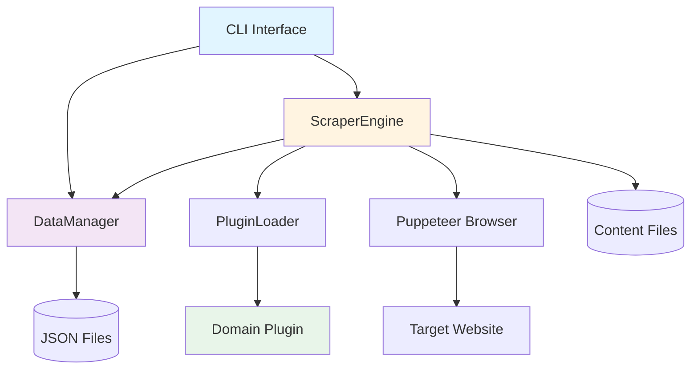
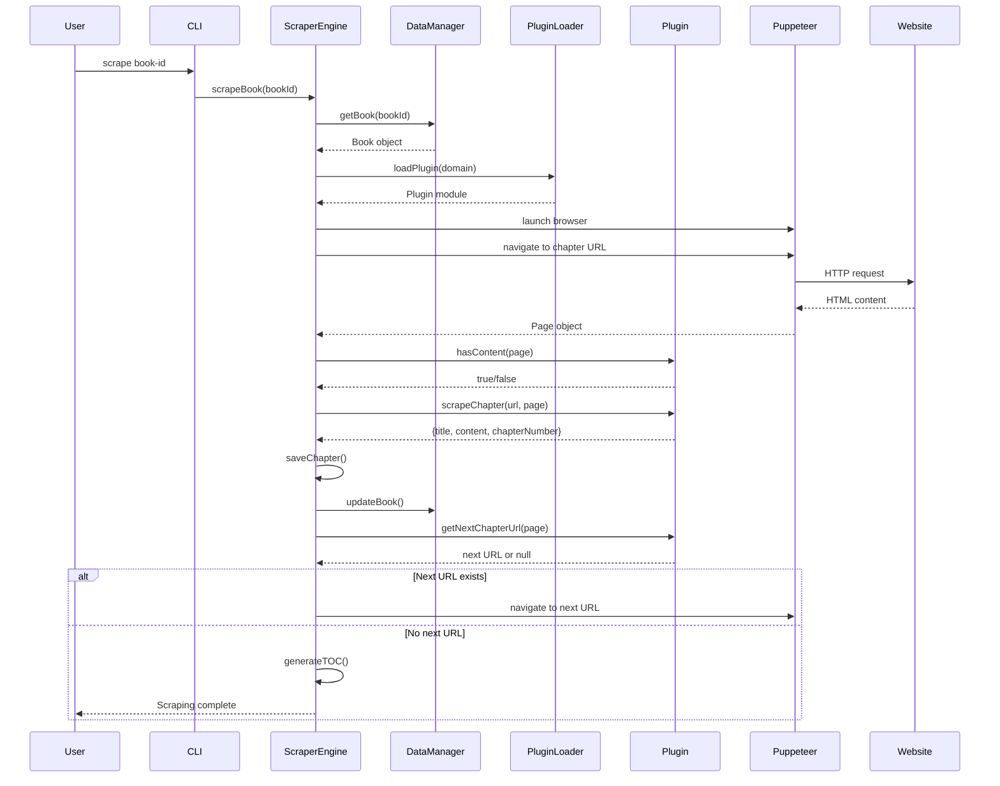
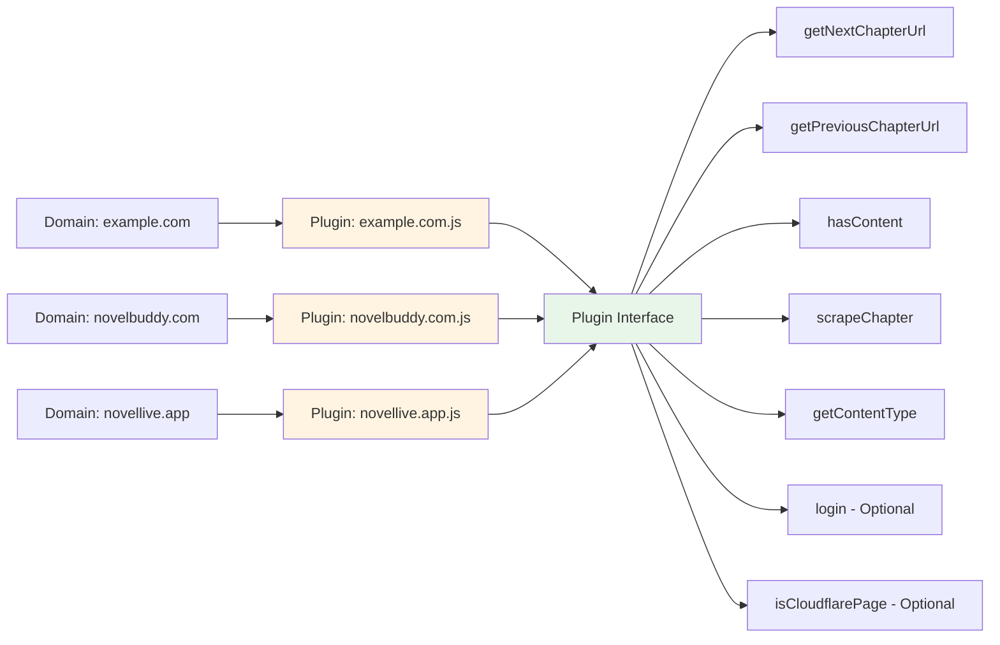

# Web Scraper Application

A plugin-based Node.js application for scraping chapter-based content from websites. Each root domain has its own plugin that handles site-specific scraping logic.

## Features

- **Plugin Architecture**: Each root domain has its own plugin file for custom scraping logic
- **Sequential Navigation**: Chapters are scraped in order by following "next chapter" links
- **Reverse Scraping**: Scrape books backwards from a starting chapter
- **Resume Support**: Automatically resumes from the last scraped chapter
- **Content Detection**: Prevents getting stuck on empty/placeholder pages
- **Multiple Content Types**: Supports both text and image-based content
- **Authentication**: Optional login support for sites requiring credentials
- **Table of Contents**: Automatic TOC generation with volume grouping
- **URL Ingestion**: Bulk import books from a list of URLs
- **Cloudflare Support**: Built-in support for Cloudflare-protected sites
- **Error Tracking**: Accumulates and reports errors during scraping sessions

## Installation

```bash
npm install
```

### Optional: Site Plugins Submodule

Site-specific plugins (manhuaus.org, novelbuddy.com, novellive.app, www.wordycrown.com) are included in `src/plugins/site-plugins/`. If you use a separate scraper-plugins repository as a submodule:

**Clone with submodules:**
```bash
git clone --recurse-submodules https://github.com/steelejoe/scraper.git
```

**If already cloned without submodules:**
```bash
git submodule update --init --recursive
```

**To add scraper-plugins as a submodule** (after creating the repo on GitHub):
```bash
git submodule add https://github.com/yourusername/scraper-plugins.git src/plugins/site-plugins
```

## Usage

### Add a Root Site

```bash
npm start add-site example.com "Example site description"
```

With credentials:
```bash
npm start add-site example.com "Example site" --username myuser --password mypass
```

### Add a Book

```bash
npm start add-book my-book-id "https://www.example.com/book/chapter-1"
```

The URL should point to the first chapter of the book. The root site domain, path, and plugin will be automatically extracted from the URL. The plugin is determined by the domain (1:1 relationship between site and plugin).

Options:
- `--root-path <path>`: Optional base path for the book (e.g., `/book-name/`). If not provided, will be extracted from the starting URL
- `--title <title>`: Optional book title

### List Sites and Books

```bash
npm start list-sites
npm start list-books
```

### Scrape a Book (Forward)

```bash
npm start scrape my-book-id
```

Options:
- `--force-save`: Force save chapters even if they already exist (useful for fixing bad scrapes or updated content)
- `--debug`: Enable debug logging output

### Scrape a Book (Reverse)

Scrape backwards from the starting chapter:

```bash
npm start scrape-reverse my-book-id
```

Or specify the chapter number explicitly:

```bash
npm start scrape-reverse my-book-id 5.0027
```

Options:
- `--force-save`: Force save chapters even if they already exist
- `--debug`: Enable debug logging output

### Resume Scraping

```bash
npm start resume my-book-id
```

Options:
- `--force-save`: Force save chapters even if they already exist
- `--debug`: Enable debug logging output

### Generate Table of Contents

Generate or update the TOC.md file for a book:

```bash
npm start generate-toc my-book-id
```

### Ingest URLs from File

Bulk import books from a file containing URLs (one per line):

```bash
npm start ingest-urls urls.txt
```

The file can contain comments (lines starting with `#`) and empty lines. Each URL will:
- Auto-create the root site if it doesn't exist
- Create a book record with an auto-generated ID (based on the URL path)
- Skip duplicate books (by root path)

## Project Structure

```
scraper/
├── src/
│   ├── cli/              # CLI interface
│   ├── data/             # Data manager for JSON files
│   │   └── DataManager.js
│   ├── models/           # Data models (Book, RootSite)
│   ├── scraper/          # Scraper engine and plugin loader
│   │   ├── ScraperEngine.js
│   │   └── PluginLoader.js
│   └── plugins/          # Plugin files (one per domain)
│       ├── base.js       # Plugin template
│       ├── example.com.js # Example plugin
│       └── site-plugins/ # Site-specific plugins (or submodule)
│           └── plugins/
│               └── {domain}.js
├── content/              # Data directory (created at runtime)
│   ├── root-sites.json   # Root site configurations
│   ├── books.json        # Book metadata
│   └── {book-id}/        # Scraped content directory
│       ├── TOC.md        # Generated table of contents
│       └── {chapter}.md  # Chapter markdown files
└── package.json
```

## Architecture

### System Overview



### Data Flow



### Plugin System



## Creating a Plugin

Plugins can live in `src/plugins/` or any visible subdirectory (e.g., `src/plugins/site-plugins/plugins/`). Folders starting with `.` are excluded.

1. Copy `src/plugins/base.js` to `src/plugins/{domain}.js` (or `src/plugins/site-plugins/plugins/{domain}.js`)
2. Implement the required methods:
   - `getNextChapterUrl(page)` - Extract next chapter URL from current page
   - `getPreviousChapterUrl(page)` - Extract previous chapter URL from current page
   - `hasContent(page)` - Detect if page has actual content
   - `scrapeChapter(url, page, options)` - Scrape chapter content
   - `getContentType()` - Return 'text' or 'image'
3. Optional methods:
   - `login(credentials, page)` - Handle authentication
   - `isCloudflarePage()` - Return true if site uses Cloudflare protection

See `src/plugins/base.js` for detailed method signatures and `src/plugins/example.com.js` for a complete example.

### Plugin Method Details

#### `getNextChapterUrl(page)`
Returns the URL of the next chapter, or `null` if no next chapter exists.

#### `getPreviousChapterUrl(page)`
Returns the URL of the previous chapter, or `null` if no previous chapter exists. Used for reverse scraping.

#### `hasContent(page)`
Returns `true` if the page has actual content, `false` for empty/placeholder pages. This prevents updating `lastPathScraped` when encountering empty pages.

#### `scrapeChapter(url, page, options)`
Returns an object with:
- `title` (string): Chapter title
- `content` (string): Text content or markdown
- `chapterNumber` (number): Chapter number for ordering (supports decimals like `1.0001` for volume.chapter format)
- `bookTitle` (string, optional): Book title (only used if book record doesn't have a title)
- `images` (string[], optional): Array of image URLs for image-based content

Options object may contain:
- `scrollDelay` (number): Delay between scrolls
- `maxScrolls` (number): Maximum number of scrolls
- `debug` (boolean): Debug mode flag
- `chapterNumber` (number, optional): Known chapter number (for reverse scraping)

#### `getContentType()`
Returns `'text'` for text-based content or `'image'` for image-based content (like manga/comics).

#### `login(credentials, page)` (Optional)
Handles authentication. Only called if credentials are provided in the root site configuration. The `credentials` object contains `username` and `password`.

#### `isCloudflarePage()` (Optional)
Returns `true` if the site uses Cloudflare protection. When `true`, the scraper uses non-headless mode to avoid detection.

## Data Models

### RootSite

Stored in `content/root-sites.json`:

- `domain` (string): Root domain (e.g., "example.com" or "www.example.com")
- `description` (string): Site description
- `credentials` (object, optional): `{ username, password }` for authentication

### Book

Stored in `content/books.json`:

- `id` (string): Unique book identifier
- `rootSite` (string): Root site domain
- `rootPath` (string): Base path for the book (e.g., "/book-name/")
- `plugin` (string): Plugin domain to use (same as rootSite)
- `lastPathScraped` (string, nullable): Last chapter path scraped (for resuming)
- `startingPath` (string, nullable): Initial chapter path (starting point for scraping)
- `title` (string, nullable): Book title
- `contentType` (string, nullable): 'text' or 'image'
- `chapters` (array): Array of chapter objects with `{ path, number }` or legacy string paths

## Scraping Flow

### Forward Scraping

1. Load book and root site data
2. Load appropriate plugin for the domain
3. Launch Puppeteer browser (headless or visible based on Cloudflare detection)
4. Login if credentials exist
5. Determine starting URL (priority: `lastPathScraped` > `startingPath`)
6. For each chapter:
   - Navigate to chapter URL
   - Scroll to load full content
   - Check if page has content (`hasContent()`)
   - If content exists:
     - Extract content using `scrapeChapter()`
     - Save as markdown file
     - Add chapter to `book.chapters` array
     - Update `book.lastPathScraped`
     - Update navigation links in previous/next chapters
     - Generate/update TOC.md
   - Get next chapter URL (`getNextChapterUrl()`)
   - If next URL exists and hasn't been scraped, continue loop
   - If no next URL or already scraped, exit loop
7. Cleanup browser and report errors

### Reverse Scraping

Similar to forward scraping, but:
- Uses `getPreviousChapterUrl()` instead of `getNextChapterUrl()`
- Starts from `startingPath` or `lastPathScraped`
- Can extract chapter number from initial page if not provided
- Uses fallback chapter numbering if plugin can't extract chapter number

## Content Storage

Chapters are saved as markdown files in `content/{book-id}/` with:
- Filename based on sanitized chapter path
- Chapter title as heading
- Navigation links (previous/next) at top and bottom
- Text or image content
- Chapter numbers for ordering (supports decimal format like `1.0001` for volumes)

Table of Contents (`TOC.md`) is automatically generated/updated after each chapter is scraped, grouped by volume.

## Error Handling

The scraper accumulates errors during scraping sessions:
- URL validation errors (next/previous URL doesn't match root path)
- Chapter number extraction errors
- Content detection failures

Errors are reported at the end of the scraping session, and scraping continues when possible.

## License

ISC
