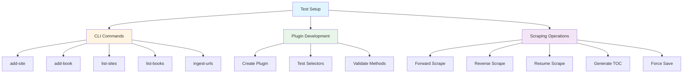
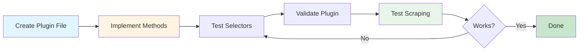
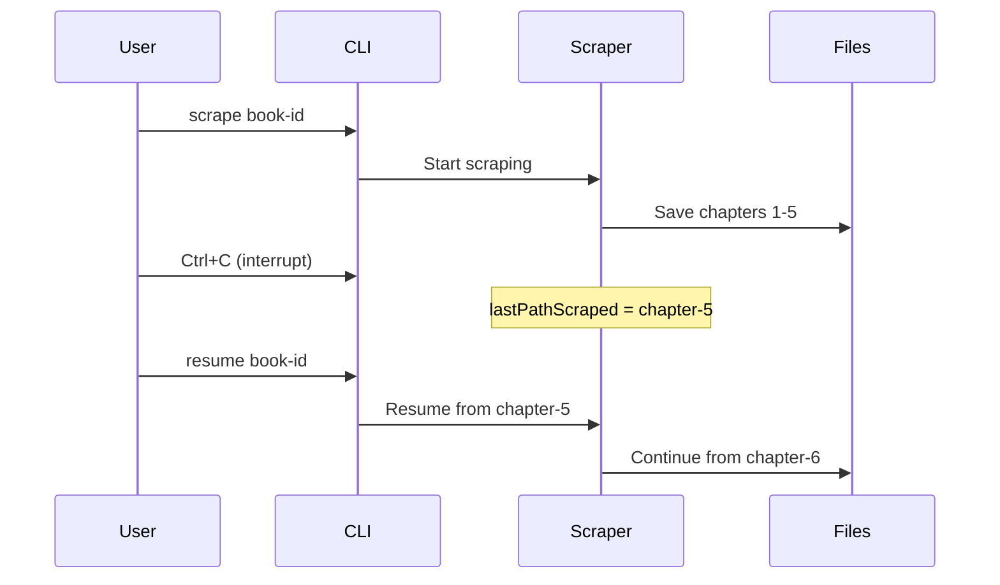
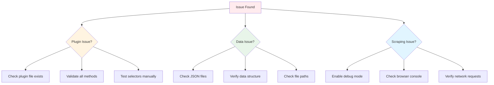

# Testing Guide

This guide will help you test the scraper application comprehensively.

## Prerequisites

1. **Install dependencies** (if not already done):
```bash
npm install
```

2. **Verify installation**:
```bash
node src/cli/index.js --help
```

You should see the CLI help menu with all available commands.

## Testing Architecture



## Testing Steps

### 1. Test CLI Commands (Without Scraping)

#### List Sites and Books (should be empty initially)
```bash
node src/cli/index.js list-sites
node src/cli/index.js list-books
```

#### Add a Root Site
```bash
node src/cli/index.js add-site example.com "Example website for testing"
```

Or with credentials:
```bash
node src/cli/index.js add-site example.com "Example website" --username testuser --password testpass
```

#### Verify the site was added
```bash
node src/cli/index.js list-sites
```

You should see the site listed with its description and credential status.

#### Add a Book
```bash
node src/cli/index.js add-book test-book "https://example.com/book/chapter-1"
```

**Note:** The plugin is automatically determined from the domain. For example, a URL with domain `example.com` will use the plugin `src/plugins/example.com.js`. The plugin name must match the domain (1:1 relationship).

**Optional flags:**
- `--title "Book Title"`: Set the book title
- `--root-path "/book-name/"`: Override the auto-extracted root path

#### Verify the book was added
```bash
node src/cli/index.js list-books
```

You should see the book with its ID, root site, root path, plugin, and other metadata.

#### Test URL Ingestion

Create a file `test-urls.txt`:
```
# This is a comment
https://example.com/book1/chapter-1
https://example.com/book2/chapter-1
https://novelbuddy.com/book3/chapter-1
```

Then run:
```bash
node src/cli/index.js ingest-urls test-urls.txt
```

This should:
- Create sites for each unique domain
- Create books for each URL
- Skip duplicates if run again
- Show a summary of created/skipped items

### 2. Test with a Real Website

To test actual scraping, you'll need to:

1. **Create or modify a plugin** for your target website:
   - Copy `src/plugins/base.js` to `src/plugins/yourdomain.com.js`
   - Update the selectors and logic for your target site
   - See the plugin documentation in `src/plugins/base.js` for the required interface
   - Implement all required methods:
     - `getNextChapterUrl(page)`
     - `getPreviousChapterUrl(page)`
     - `hasContent(page)`
     - `scrapeChapter(url, page, options)`
     - `getContentType()`

2. **Add the root site**:
```bash
node src/cli/index.js add-site yourdomain.com "Description of the site"
```

3. **Add a book with the first chapter URL**:
```bash
node src/cli/index.js add-book my-book "https://yourdomain.com/book/chapter-1"
```

The plugin will be automatically determined from the domain (`yourdomain.com`).

4. **Test forward scraping**:
```bash
node src/cli/index.js scrape my-book
```

5. **Test reverse scraping**:
```bash
node src/cli/index.js scrape-reverse my-book
```

Or with explicit chapter number:
```bash
node src/cli/index.js scrape-reverse my-book 1.0001
```

6. **Test TOC generation**:
```bash
node src/cli/index.js generate-toc my-book
```

Check the generated `content/my-book/TOC.md` file.

### 3. Testing Plugin Development



You can test plugins incrementally:

1. **Start with a simple test site** (like a blog or documentation site)
2. **Create a minimal plugin** that implements:
   - `getNextChapterUrl(page)` - Find the "next" link
   - `getPreviousChapterUrl(page)` - Find the "previous" link
   - `hasContent(page)` - Check if page has content
   - `scrapeChapter(url, page, options)` - Extract title and content
   - `getContentType()` - Return 'text' or 'image'

3. **Test the plugin** by running:
```bash
node src/cli/index.js scrape your-book-id
```

4. **Debug with verbose output**:
```bash
node src/cli/index.js scrape your-book-id --debug
```

### 4. Testing Edge Cases

#### Test Resume Functionality



1. Start scraping a book:
```bash
node src/cli/index.js scrape my-book
```

2. Interrupt it (Ctrl+C) after a few chapters

3. Check that `content/books.json` has `lastPathScraped` set

4. Resume:
```bash
node src/cli/index.js resume my-book
```

It should continue from the last scraped chapter.

#### Test Force Save

1. Scrape a book normally:
```bash
node src/cli/index.js scrape my-book
```

2. Scrape again with `--force-save`:
```bash
node src/cli/index.js scrape my-book --force-save
```

Chapters should be re-scraped and overwritten, useful for fixing bad scrapes or getting updated content.

#### Test Content Detection

- Create a plugin that returns `false` from `hasContent()` for empty pages
- Verify that `lastPathScraped` is not updated when encountering empty pages
- Verify that the scraper tries the next chapter if the current one is empty

#### Test Sequential Navigation

- Verify that chapters are scraped in order
- Check that the scraper stops when it encounters an already-scraped chapter (without `--force-save`)
- Verify navigation links are correctly updated in chapter files

#### Test Reverse Scraping

1. Scrape forward to get some chapters:
```bash
node src/cli/index.js scrape my-book
```

2. Scrape reverse from a specific chapter:
```bash
node src/cli/index.js scrape-reverse my-book 5.0027
```

Should scrape backwards from chapter 5.0027, 5.0026, 5.0025, etc.

#### Test Chapter Number Extraction

- Test with integer chapter numbers (1, 2, 3, ...)
- Test with decimal chapter numbers (1.0001, 1.0002, ... for volume.chapter format)
- Test fallback numbering when plugin can't extract chapter number
- Verify chapters are sorted correctly by number

#### Test URL Validation

- Verify that scraping stops if next/previous URL doesn't match the book's root path
- Check that errors are reported for invalid URLs

### 5. Verify Output

After scraping, check:

#### Content Files
```bash
ls -la content/my-book/
```

Should contain:
- `TOC.md` - Table of contents
- `{chapter}.md` files - Individual chapter files

#### Book Metadata
```bash
cat content/books.json
```

Should show:
- Updated `lastPathScraped`
- Updated `chapters` array with paths and numbers
- Book title (if extracted)

#### Chapter Files Structure

Each chapter file should contain:
- Chapter title as heading (with chapter number prefix if available)
- Navigation links at top (previous/next)
- Content (text or images)
- Navigation links at bottom (previous/next)

Example:
```markdown
# 1.0001 Chapter Title

[← Previous Chapter](./prev.md) | [Next Chapter →](./next.md)

Chapter content here...

---

[← Previous Chapter](./prev.md) | [Next Chapter →](./next.md)
```

#### TOC Structure

The `TOC.md` file should:
- Have the book title (if set)
- Be grouped by volume
- List chapters with proper formatting
- Have working links to chapter files

Example:
```markdown
# Table of Contents

**Book Title**

---

## 📖 Volume 1

- [0001. Chapter One Title](./chapter1.md)
- [0002. Chapter Two Title](./chapter2.md)

## 📖 Volume 2

- [0001. Volume 2 Chapter One](./chapter3.md)
```

### 6. Debugging Tips



1. **Check plugin loading**:
   - Ensure plugin file exists: `src/plugins/{domain}.js`
   - Verify all required methods are exported
   - Check for syntax errors
   - Run with `--debug` flag for verbose output

2. **Check data files**:
   - `content/root-sites.json` - Verify root site exists
   - `content/books.json` - Verify book configuration
   - Check JSON syntax is valid

3. **Run with debug output**:
```bash
node src/cli/index.js scrape my-book --debug
```

The scraper logs detailed progress to console, including:
- URLs being scraped
- Content detection results
- Chapter numbers extracted
- Errors encountered

4. **Test selectors manually**:
   - Use browser DevTools to verify CSS selectors work
   - Test in Puppeteer's headless browser if needed
   - Check for dynamic content that loads after page load

5. **Check browser automation**:
   - Verify Puppeteer can launch (Chrome/Chromium should be available)
   - Check if site uses Cloudflare (enable `isCloudflarePage()` in plugin)
   - Monitor network requests for blocking or redirects

6. **Verify file system**:
   - Check that `content/` directory is writable
   - Verify sufficient disk space
   - Check file permissions

## Example Test Workflow

```bash
# 1. Install dependencies
npm install

# 2. Add a test site
node src/cli/index.js add-site example.com "Example site"

# 3. Add a test book (plugin automatically determined from domain)
node src/cli/index.js add-book test "https://example.com/page1"

# 4. List to verify
node src/cli/index.js list-books

# 5. Try scraping (will use example.com plugin)
node src/cli/index.js scrape test --debug

# 6. Check output
ls -la content/test/
cat content/books.json

# 7. Test resume
node src/cli/index.js resume test

# 8. Generate TOC
node src/cli/index.js generate-toc test
cat content/test/TOC.md

# 9. Test reverse scraping
node src/cli/index.js scrape-reverse test

# 10. Test force save
node src/cli/index.js scrape test --force-save
```

## Testing with Mock/Test Sites

For development, you can:

1. **Use a local test server**:
   - Create a simple HTML site with chapter navigation
   - Run it locally (e.g., `python -m http.server 8000`)
   - Use `localhost:8000` as the domain
   - Create a plugin at `src/plugins/localhost:8000.js` (note: use filename-safe name)

2. **Use public test sites**:
   - Sites like `example.com`, `httpbin.org`, or documentation sites
   - Create appropriate plugins for them
   - Note: Some sites may block automated access

## Testing Checklist

- [ ] CLI commands work (add-site, add-book, list-sites, list-books)
- [ ] URL ingestion works (ingest-urls)
- [ ] Plugin loads correctly
- [ ] Forward scraping works
- [ ] Reverse scraping works
- [ ] Resume functionality works
- [ ] Force save works
- [ ] Content detection works (empty pages are skipped)
- [ ] Chapter numbers are extracted correctly
- [ ] Navigation links are correct
- [ ] TOC generation works
- [ ] Error handling works (invalid URLs, missing content, etc.)
- [ ] Debug mode provides useful information
- [ ] Cloudflare detection works (if applicable)
- [ ] Authentication works (if applicable)
- [ ] Image content type works (if applicable)
- [ ] Text content type works
- [ ] Chapters are sorted correctly
- [ ] Volume grouping in TOC works

## Troubleshooting

### "Plugin not found"
- Ensure plugin file exists in `src/plugins/{domain}.js`
- Check that domain matches exactly (including subdomain)
- Verify file has correct exports

### "Root site not found"
- Add the site first with `add-site`
- Check domain spelling matches exactly

### "No content detected"
- Check your `hasContent()` implementation
- Verify selectors match the page structure
- Use `--debug` to see what's being checked

### "No next chapter found"
- Verify `getNextChapterUrl()` selector matches the site structure
- Check if the site uses JavaScript to load navigation links
- Use browser DevTools to inspect the page

### "Could not determine chapter number"
- Check your `scrapeChapter()` implementation
- Verify chapter number extraction logic
- Use `--debug` to see extraction attempts
- Check if fallback numbering is working

### Puppeteer errors
- Ensure Chrome/Chromium is available (Puppeteer will download it automatically)
- Check system dependencies for headless Chrome
- Try non-headless mode (enable `isCloudflarePage()` in plugin)

### "URL does not match root path"
- Verify the book's `rootPath` is correct
- Check if the site structure changed
- Review URL validation logic

### Content files not saving
- Check `content/` directory permissions
- Verify disk space is available
- Check for file system errors in console output
