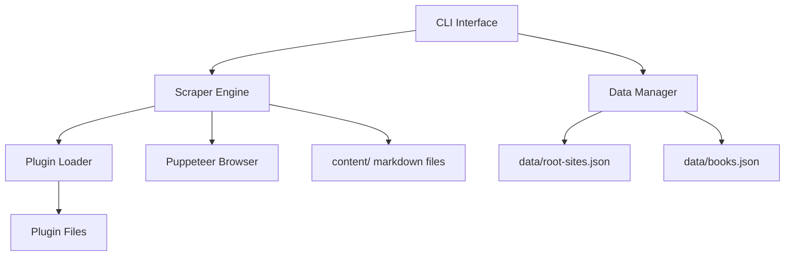

# Node.js content scraping project
_Exported on 12/29/2025 at 08:35:38 PST from Cursor (1.7.12)_

---

**User**

I want to build a node application for scraping website content. I want to scrape multiple sites with different ways of layoung out their content. The content is expected to be in chapters, and each chapter will be on a single web page although user actions like scrolling may be required to download the full page. Content can consit of text or images, but I will be able to indicate what type of content is expected in the definition of a site. I am expecting a plugin type architecture where each root domain will have a plugin. Chapters will be organized into books and each book will specify the following: the root site; the root path for this specific book; the plugin to use when scraping content; the last path scraped; the set of all chapters scraped so far. There should be a table of root sites with each root site having: the root domain; a description; optional user credentials. There should also be a table of books with contents as described above.

---

**Cursor**

Clarifying a few decisions before drafting the plan:


Checking the current project structure:


Creating the plan:


---

**User**

This looks like a good start, but I see a couple of problems. For most sites, there is no way to get the entire list of chapters at once. You need to get the first chapter and then from that page get the next chapter. They must be navigated to in order. Saving the last page scraped is super important because that the oinly way to (A) know there is more content and (B) navigate to that content. 

---

**Cursor**

Updating the plan to use sequential navigation: remove `getChapterUrls()`, add a "get next chapter URL" method, and start from `lastPathScraped` (or rootPath if none).


Updating the plan to use sequential navigation:


```markdown
---
name: Web Scraper Application
overview: Build a Node.js CLI application with a plugin-based architecture for scraping chapter-based content from multiple websites, storing metadata in JSON files and content in Markdown format.
todos:
  - id: setup
    content: Setup project structure, package.json with dependencies (puppeteer, commander, fs-extra), and initialize data directories
    status: pending
  - id: data-models
    content: Create RootSite and Book models with validation logic
    status: pending
    dependencies:
      - setup
  - id: data-manager
    content: Implement DataManager class for reading/writing root-sites.json and books.json
    status: pending
    dependencies:
      - data-models
  - id: plugin-loader
    content: Create PluginLoader to load and validate plugin files from plugins directory
    status: pending
    dependencies:
      - setup
  - id: base-plugin
    content: Create base plugin template with required interface documentation
    status: pending
    dependencies:
      - plugin-loader
  - id: scraper-engine
    content: Implement ScraperEngine with Puppeteer integration, scrolling logic, and chapter scraping orchestration
    status: pending
    dependencies:
      - data-manager
      - plugin-loader
  - id: cli-interface
    content: "Build CLI with commands: scrape, add-site, add-book, list-sites, list-books, resume"
    status: pending
    dependencies:
      - scraper-engine
  - id: example-plugin
    content: Create example plugin template showing how to implement site-specific scraping logic
    status: pending
    dependencies:
      - base-plugin
  - id: error-handling
    content: Add comprehensive error handling, logging, and retry logic for network operations
    status: pending
    dependencies:
      - scraper-engine
      - cli-interface
  - id: documentation
    content: Write README.md with architecture overview, usage examples, and plugin development guide
    status: pending
    dependencies:
      - example-plugin
---

# Web Scraper A

pplication

## Architecture Overview

The application will use a plugin-based architecture where each root domain has its own plugin file that handles site-specific scraping logic. Metadata (root sites and books) will be stored in JSON files, and scraped content will be saved as Markdown files.




## Project Structure

```javascript
scraper/
├── src/
│   ├── cli/
│   │   └── index.js              # CLI entry point and command handlers
│   ├── models/
│   │   ├── RootSite.js           # RootSite data model
│   │   └── Book.js               # Book data model
│   ├── scraper/
│   │   ├── ScraperEngine.js      # Main scraping orchestration
│   │   └── PluginLoader.js       # Loads and manages plugins
│   ├── data/
│   │   └── DataManager.js         # JSON file read/write operations
│   └── plugins/
│       ├── base.js               # Base plugin interface/example
│       └── example.com.js        # Example plugin template
├── data/
│   ├── root-sites.json           # Root sites table
│   └── books.json                # Books table
├── content/                      # Scraped markdown files
│   └── {book-id}/
│       └── {chapter-path}.md
├── package.json
└── README.md
```


## Data Models

### RootSite (`data/root-sites.json`)

```json
{
  "sites": [
    {
      "domain": "example.com",
      "description": "Example site description",
      "credentials": {
        "username": "user",
        "password": "pass"
      }
    }
  ]
}
```


### Book (`data/books.json`)

```json
{
  "books": [
    {
      "id": "unique-book-id",
      "rootSite": "example.com",
      "rootPath": "/book/path",
      "plugin": "example.com",
      "lastPathScraped": "/book/path/chapter-5",
      "chapters": ["/book/path/chapter-1", "/book/path/chapter-2", ...]
    }
  ]
}
```


## Plugin Interface

Each plugin in `src/plugins/{domain}.js` must export:

- `getNextChapterUrl(page)` - Extracts the "next chapter" URL from the current page. Returns the URL string or null if no next chapter exists.

- `scrapeChapter(url, page, options)` - Scrapes a single chapter, handles scrolling, returns content object

- `getContentType()` - Returns 'text' or 'image'
- `login(credentials, page)` - Optional: handles authentication if credentials provided

Plugin function signatures:

```javascript
async getNextChapterUrl(page) -> string | null
async scrapeChapter(url, page, options) -> { title: string, content: string, images?: string[] }
getContentType() -> 'text' | 'image'
async login(credentials, page) -> void  // optional
```


## Core Components

### DataManager (`src/data/DataManager.js`)

- `loadRootSites()` - Reads `data/root-sites.json`
- `saveRootSites(sites)` - Writes root sites

- `loadBooks()` - Reads `data/books.json`
- `saveBooks(books)` - Writes books

- `addRootSite(site)` - Adds new root site
- `addBook(book)` - Adds new book

- `updateBook(bookId, updates)` - Updates book (lastPathScraped, chapters)

### PluginLoader (`src/scraper/PluginLoader.js`)

- `loadPlugin(domain)` - Loads plugin from `src/plugins/{domain}.js`
- `validatePlugin(plugin)` - Ensures plugin has required exports

### ScraperEngine (`src/scraper/ScraperEngine.js`)

- `scrapeBook(bookId)` - Main scraping orchestration:

1. Load book and root site data
2. Load appropriate plugin
3. Launch Puppeteer browser
4. Login if credentials exist

5. Get chapter URLs from root path
6. For each unscraped chapter:

    - Navigate to chapter URL

    - Scroll to load full content
    - Extract content using plugin

    - Save as markdown file
    - Update book metadata

7. Cleanup browser

### CLI (`src/cli/index.js`)

Commands:

- `scrape <book-id>` - Scrape a specific book

- `add-site <domain> <description> [--username] [--password]` - Add root site
- `add-book <id> <root-site> <root-path> <plugin>` - Add book
- `list-sites` - List all root sites

- `list-books` - List all books
- `resume <book-id>` - Resume scraping from last path

## Implementation Details

### Scraping Flow

1. ScraperEngine loads book and root site
2. Loads plugin for the domain
3. Launches Puppeteer with headless browser

4. If credentials exist, calls plugin.login()
5. Calls plugin.getChapterUrls() to discover chapters

6. Filters out already-scraped chapters (from book.chapters)
7. For each chapter:

- Navigate to URL

- Scroll page to trigger lazy loading
- Call plugin.scrapeChapter()

- Format content as markdown (handle text and images)
- Save to `content/{book-id}/{sanitized-chapter-path}.md`

- Update book.chapters and book.lastPathScraped
- Save updated book data

8. Close browser

### Markdown Format

- Text content: Direct markdown

- Images: `` format, optionally download images locally

- Chapter title as H1 header

### Error Handling

- Plugin validation errors

- Network/timeout errors (retry logic)
- Invalid book/site references
- File system errors

## Dependencies

- `puppeteer` - Browser automation
- `commander` or `yargs` - CLI framework

- `fs-extra` - Enhanced file system operations
- `path` - Path utilities (built-in)

## Todos

- [ ] Setup project structure and package.json
- [ ] Implement DataManager for JSON file operations

- [ ] Create RootSite and Book models
- [ ] Implement PluginLoader with validation
- [ ] Create base plugin template

- [ ] Implement ScraperEngine with Puppeteer integration
- [ ] Build CLI interface with all commands
- [ ] Create example plugin template

- [ ] Add error handling and logging
```

```markdown
---
name: Web Scraper Application
overview: Build a Node.js CLI application with a plugin-based architecture for scraping chapter-based content from multiple websites, storing metadata in JSON files and content in Markdown format.
todos:
  - id: setup
    content: Setup project structure, package.json with dependencies (puppeteer, commander, fs-extra), and initialize data directories
    status: pending
  - id: data-models
    content: Create RootSite and Book models with validation logic
    status: pending
    dependencies:
      - setup
  - id: data-manager
    content: Implement DataManager class for reading/writing root-sites.json and books.json
    status: pending
    dependencies:
      - data-models
  - id: plugin-loader
    content: Create PluginLoader to load and validate plugin files from plugins directory
    status: pending
    dependencies:
      - setup
  - id: base-plugin
    content: Create base plugin template with required interface documentation
    status: pending
    dependencies:
      - plugin-loader
  - id: scraper-engine
    content: Implement ScraperEngine with Puppeteer integration, scrolling logic, and chapter scraping orchestration
    status: pending
    dependencies:
      - data-manager
      - plugin-loader
  - id: cli-interface
    content: "Build CLI with commands: scrape, add-site, add-book, list-sites, list-books, resume"
    status: pending
    dependencies:
      - scraper-engine
  - id: example-plugin
    content: Create example plugin template showing how to implement site-specific scraping logic
    status: pending
    dependencies:
      - base-plugin
  - id: error-handling
    content: Add comprehensive error handling, logging, and retry logic for network operations
    status: pending
    dependencies:
      - scraper-engine
      - cli-interface
  - id: documentation
    content: Write README.md with architecture overview, usage examples, and plugin development guide
    status: pending
    dependencies:
      - example-plugin
---

# Web Scraper A

pplication

## Architecture Overview

The application will use a plugin-based architecture where each root domain has its own plugin file that handles site-specific scraping logic. Metadata (root sites and books) will be stored in JSON files, and scraped content will be saved as Markdown files.


## Project Structure

```javascript
scraper/
├── src/
│   ├── cli/
│   │   └── index.js              # CLI entry point and command handlers
│   ├── models/
│   │   ├── RootSite.js           # RootSite data model
│   │   └── Book.js               # Book data model
│   ├── scraper/
│   │   ├── ScraperEngine.js      # Main scraping orchestration
│   │   └── PluginLoader.js       # Loads and manages plugins
│   ├── data/
│   │   └── DataManager.js         # JSON file read/write operations
│   └── plugins/
│       ├── base.js               # Base plugin interface/example
│       └── example.com.js        # Example plugin template
├── data/
│   ├── root-sites.json           # Root sites table
│   └── books.json                # Books table
├── content/                      # Scraped markdown files
│   └── {book-id}/
│       └── {chapter-path}.md
├── package.json
└── README.md
```

## Data Models

### RootSite (`data/root-sites.json`)

```json
{
  "sites": [
    {
      "domain": "example.com",
      "description": "Example site description",
      "credentials": {
        "username": "user",
        "password": "pass"
      }
    }
  ]
}
```

### Book (`data/books.json`)

```json
{
  "books": [
    {
      "id": "unique-book-id",
      "rootSite": "example.com",
      "rootPath": "/book/path",
      "plugin": "example.com",
      "lastPathScraped": "/book/path/chapter-5",
      "chapters": ["/book/path/chapter-1", "/book/path/chapter-2", ...]
    }
  ]
}
```

## Plugin Interface

Each plugin in `src/plugins/{domain}.js` must export:

- `getNextChapterUrl(page)` - Extracts the "next chapter" URL from the current page. Returns the URL string or null if no next chapter exists.

- `scrapeChapter(url, page, options)` - Scrapes a single chapter, handles scrolling, returns content object

- `getContentType()` - Returns 'text' or 'image'
- `login(credentials, page)` - Optional: handles authentication if credentials provided

Plugin function signatures:

```javascript
async getNextChapterUrl(page) -> string | null
async scrapeChapter(url, page, options) -> { title: string, content: string, images?: string[] }
getContentType() -> 'text' | 'image'
async login(credentials, page) -> void  // optional
```

## Core Components

### DataManager (`src/data/DataManager.js`)

- `loadRootSites()` - Reads `data/root-sites.json`
- `saveRootSites(sites)` - Writes root sites

- `loadBooks()` - Reads `data/books.json`
- `saveBooks(books)` - Writes books

- `addRootSite(site)` - Adds new root site
- `addBook(book)` - Adds new book

- `updateBook(bookId, updates)` - Updates book (lastPathScraped, chapters)

### PluginLoader (`src/scraper/PluginLoader.js`)

- `loadPlugin(domain)` - Loads plugin from `src/plugins/{domain}.js`
- `validatePlugin(plugin)` - Ensures plugin has required exports

### ScraperEngine (`src/scraper/ScraperEngine.js`)

- `scrapeBook(bookId)` - Main scraping orchestration:

1. Load book and root site data
2. Load appropriate plugin
3. Launch Puppeteer browser
4. Login if credentials exist
5. Determine starting URL:
   - If `book.lastPathScraped` exists, start there
   - Otherwise, start at `book.rootPath`
6. Sequential scraping loop:
   - Navigate to current chapter URL
   - Scroll to load full content
   - Extract content using `plugin.scrapeChapter()`
   - Save as markdown file
   - Add chapter path to `book.chapters` set
   - Update `book.lastPathScraped` to current URL
   - Save updated book data
   - Call `plugin.getNextChapterUrl()` to get next chapter
   - If next URL exists and hasn't been scraped, continue loop
   - If no next URL or already scraped, exit loop
7. Cleanup browser

### CLI (`src/cli/index.js`)

Commands:

- `scrape <book-id>` - Scrape a specific book

- `add-site <domain> <description> [--username] [--password]` - Add root site
- `add-book <id> <root-site> <root-path> <plugin>` - Add book
- `list-sites` - List all root sites

- `list-books` - List all books
- `resume <book-id>` - Resume scraping from last path

## Implementation Details

### Scraping Flow

1. ScraperEngine loads book and root site
2. Loads plugin for the domain
3. Launches Puppeteer with headless browser

4. If credentials exist, calls plugin.login()
5. Calls plugin.getChapterUrls() to discover chapters

6. Filters out already-scraped chapters (from book.chapters)
7. For each chapter:

- Navigate to URL

- Scroll page to trigger lazy loading
- Call plugin.scrapeChapter()

- Format content as markdown (handle text and images)
- Save to `content/{book-id}/{sanitized-chapter-path}.md`

- Update book.chapters and book.lastPathScraped
- Save updated book data

8. Close browser

### Markdown Format

- Text content: Direct markdown

- Images: `` format, optionally download images locally

- Chapter title as H1 header

### Error Handling

- Plugin validation errors

- Network/timeout errors (retry logic)
- Invalid book/site references
- File system errors

## Dependencies

- `puppeteer` - Browser automation
- `commander` or `yargs` - CLI framework

- `fs-extra` - Enhanced file system operations
- `path` - Path utilities (built-in)

## Todos

- [ ] Setup project structure and package.json
- [ ] Implement DataManager for JSON file operations

- [ ] Create RootSite and Book models
- [ ] Implement PluginLoader with validation
- [ ] Create base plugin template

- [ ] Implement ScraperEngine with Puppeteer integration
- [ ] Build CLI interface with all commands
- [ ] Create example plugin template

- [ ] Add error handling and logging
```

```markdown
---
name: Web Scraper Application
overview: Build a Node.js CLI application with a plugin-based architecture for scraping chapter-based content from multiple websites, storing metadata in JSON files and content in Markdown format.
todos:
  - id: setup
    content: Setup project structure, package.json with dependencies (puppeteer, commander, fs-extra), and initialize data directories
    status: pending
  - id: data-models
    content: Create RootSite and Book models with validation logic
    status: pending
    dependencies:
      - setup
  - id: data-manager
    content: Implement DataManager class for reading/writing root-sites.json and books.json
    status: pending
    dependencies:
      - data-models
  - id: plugin-loader
    content: Create PluginLoader to load and validate plugin files from plugins directory
    status: pending
    dependencies:
      - setup
  - id: base-plugin
    content: Create base plugin template with required interface documentation
    status: pending
    dependencies:
      - plugin-loader
  - id: scraper-engine
    content: Implement ScraperEngine with Puppeteer integration, scrolling logic, and chapter scraping orchestration
    status: pending
    dependencies:
      - data-manager
      - plugin-loader
  - id: cli-interface
    content: "Build CLI with commands: scrape, add-site, add-book, list-sites, list-books, resume"
    status: pending
    dependencies:
      - scraper-engine
  - id: example-plugin
    content: Create example plugin template showing how to implement site-specific scraping logic
    status: pending
    dependencies:
      - base-plugin
  - id: error-handling
    content: Add comprehensive error handling, logging, and retry logic for network operations
    status: pending
    dependencies:
      - scraper-engine
      - cli-interface
  - id: documentation
    content: Write README.md with architecture overview, usage examples, and plugin development guide
    status: pending
    dependencies:
      - example-plugin
---

# Web Scraper A

pplication

## Architecture Overview

The application will use a plugin-based architecture where each root domain has its own plugin file that handles site-specific scraping logic. Metadata (root sites and books) will be stored in JSON files, and scraped content will be saved as Markdown files.


## Project Structure

```javascript
scraper/
├── src/
│   ├── cli/
│   │   └── index.js              # CLI entry point and command handlers
│   ├── models/
│   │   ├── RootSite.js           # RootSite data model
│   │   └── Book.js               # Book data model
│   ├── scraper/
│   │   ├── ScraperEngine.js      # Main scraping orchestration
│   │   └── PluginLoader.js       # Loads and manages plugins
│   ├── data/
│   │   └── DataManager.js         # JSON file read/write operations
│   └── plugins/
│       ├── base.js               # Base plugin interface/example
│       └── example.com.js        # Example plugin template
├── data/
│   ├── root-sites.json           # Root sites table
│   └── books.json                # Books table
├── content/                      # Scraped markdown files
│   └── {book-id}/
│       └── {chapter-path}.md
├── package.json
└── README.md
```

## Data Models

### RootSite (`data/root-sites.json`)

```json
{
  "sites": [
    {
      "domain": "example.com",
      "description": "Example site description",
      "credentials": {
        "username": "user",
        "password": "pass"
      }
    }
  ]
}
```

### Book (`data/books.json`)

```json
{
  "books": [
    {
      "id": "unique-book-id",
      "rootSite": "example.com",
      "rootPath": "/book/path",
      "plugin": "example.com",
      "lastPathScraped": "/book/path/chapter-5",
      "chapters": ["/book/path/chapter-1", "/book/path/chapter-2", ...]
    }
  ]
}
```

## Plugin Interface

Each plugin in `src/plugins/{domain}.js` must export:

- `getNextChapterUrl(page)` - Extracts the "next chapter" URL from the current page. Returns the URL string or null if no next chapter exists.

- `scrapeChapter(url, page, options)` - Scrapes a single chapter, handles scrolling, returns content object

- `getContentType()` - Returns 'text' or 'image'
- `login(credentials, page)` - Optional: handles authentication if credentials provided

Plugin function signatures:

```javascript
async getNextChapterUrl(page) -> string | null
async scrapeChapter(url, page, options) -> { title: string, content: string, images?: string[] }
getContentType() -> 'text' | 'image'
async login(credentials, page) -> void  // optional
```

## Core Components

### DataManager (`src/data/DataManager.js`)

- `loadRootSites()` - Reads `data/root-sites.json`
- `saveRootSites(sites)` - Writes root sites

- `loadBooks()` - Reads `data/books.json`
- `saveBooks(books)` - Writes books

- `addRootSite(site)` - Adds new root site
- `addBook(book)` - Adds new book

- `updateBook(bookId, updates)` - Updates book (lastPathScraped, chapters)

### PluginLoader (`src/scraper/PluginLoader.js`)

- `loadPlugin(domain)` - Loads plugin from `src/plugins/{domain}.js`
- `validatePlugin(plugin)` - Ensures plugin has required exports

### ScraperEngine (`src/scraper/ScraperEngine.js`)

- `scrapeBook(bookId)` - Main scraping orchestration:

1. Load book and root site data
2. Load appropriate plugin
3. Launch Puppeteer browser
4. Login if credentials exist
5. Determine starting URL:

   - If `book.lastPathScraped` exists, start there
   - Otherwise, start at `book.rootPath`

6. Sequential scraping loop:

   - Navigate to current chapter URL
   - Scroll to load full content
   - Extract content using `plugin.scrapeChapter()`
   - Save as markdown file
   - Add chapter path to `book.chapters` set
   - Update `book.lastPathScraped` to current URL
   - Save updated book data
   - Call `plugin.getNextChapterUrl()` to get next chapter
   - If next URL exists and hasn't been scraped, continue loop
   - If no next URL or already scraped, exit loop

7. Cleanup browser

### CLI (`src/cli/index.js`)

Commands:

- `scrape <book-id>` - Scrape a specific book

- `add-site <domain> <description> [--username] [--password]` - Add root site
- `add-book <id> <root-site> <root-path> <plugin>` - Add book
- `list-sites` - List all root sites

- `list-books` - List all books
- `resume <book-id>` - Resume scraping from last path

## Implementation Details

### Scraping Flow

1. ScraperEngine loads book and root site
2. Loads plugin for the domain
3. Launches Puppeteer with headless browser
4. If credentials exist, calls plugin.login()
5. Determine starting URL:
   - If `book.lastPathScraped` exists, use that as the starting point (resume)
   - Otherwise, start at `book.rootPath` (new scrape)
6. Sequential navigation loop:
   - Navigate to current chapter URL
   - Scroll page to trigger lazy loading and ensure full content is loaded
   - Call `plugin.scrapeChapter()` to extract content
   - Format content as markdown (handle text and images)
   - Save to `content/{book-id}/{sanitized-chapter-path}.md`
   - Add current chapter path to `book.chapters` set
   - Update `book.lastPathScraped` to current URL path
   - Save updated book data (critical for resumability)
   - Call `plugin.getNextChapterUrl(page)` to find next chapter link
   - If next URL exists and is not in `book.chapters`, set as current URL and continue loop
   - If no next URL found or next URL already scraped, exit loop (scraping complete)
7. Close browser

**Key Points:**
- `lastPathScraped` is essential for resuming interrupted scraping sessions
- Sequential navigation means chapters must be scraped in order
- Each chapter is saved immediately to prevent data loss
- Book metadata is updated after each chapter to maintain state

### Markdown Format

- Text content: Direct markdown

- Images: `` format, optionally download images locally

- Chapter title as H1 header

### Error Handling

- Plugin validation errors

- Network/timeout errors (retry logic)
- Invalid book/site references
- File system errors

## Dependencies

- `puppeteer` - Browser automation
- `commander` or `yargs` - CLI framework

- `fs-extra` - Enhanced file system operations
- `path` - Path utilities (built-in)

## Todos

- [ ] Setup project structure and package.json
- [ ] Implement DataManager for JSON file operations

- [ ] Create RootSite and Book models
- [ ] Implement PluginLoader with validation
- [ ] Create base plugin template

- [ ] Implement ScraperEngine with Puppeteer integration
- [ ] Build CLI interface with all commands
- [ ] Create example plugin template

- [ ] Add error handling and logging
```

```markdown
---
name: Web Scraper Application
overview: Build a Node.js CLI application with a plugin-based architecture for scraping chapter-based content from multiple websites, storing metadata in JSON files and content in Markdown format.
todos:
  - id: setup
    content: Setup project structure, package.json with dependencies (puppeteer, commander, fs-extra), and initialize data directories
    status: pending
  - id: data-models
    content: Create RootSite and Book models with validation logic
    status: pending
    dependencies:
      - setup
  - id: data-manager
    content: Implement DataManager class for reading/writing root-sites.json and books.json
    status: pending
    dependencies:
      - data-models
  - id: plugin-loader
    content: Create PluginLoader to load and validate plugin files from plugins directory
    status: pending
    dependencies:
      - setup
  - id: base-plugin
    content: Create base plugin template with required interface documentation
    status: pending
    dependencies:
      - plugin-loader
  - id: scraper-engine
    content: Implement ScraperEngine with Puppeteer integration, sequential navigation (using getNextChapterUrl), scrolling logic, and state persistence (lastPathScraped)
    status: pending
    dependencies:
      - data-manager
      - plugin-loader
  - id: cli-interface
    content: "Build CLI with commands: scrape, add-site, add-book, list-sites, list-books, resume"
    status: pending
    dependencies:
      - scraper-engine
  - id: example-plugin
    content: Create example plugin template showing how to implement site-specific scraping logic
    status: pending
    dependencies:
      - base-plugin
  - id: error-handling
    content: Add comprehensive error handling, logging, and retry logic for network operations
    status: pending
    dependencies:
      - scraper-engine
      - cli-interface
  - id: documentation
    content: Write README.md with architecture overview, usage examples, and plugin development guide
    status: pending
    dependencies:
      - example-plugin
---

# Web Scraper A

pplication

## Architecture Overview

The application will use a plugin-based architecture where each root domain has its own plugin file that handles site-specific scraping logic. Metadata (root sites and books) will be stored in JSON files, and scraped content will be saved as Markdown files.


## Project Structure

```javascript
scraper/
├── src/
│   ├── cli/
│   │   └── index.js              # CLI entry point and command handlers
│   ├── models/
│   │   ├── RootSite.js           # RootSite data model
│   │   └── Book.js               # Book data model
│   ├── scraper/
│   │   ├── ScraperEngine.js      # Main scraping orchestration
│   │   └── PluginLoader.js       # Loads and manages plugins
│   ├── data/
│   │   └── DataManager.js         # JSON file read/write operations
│   └── plugins/
│       ├── base.js               # Base plugin interface/example
│       └── example.com.js        # Example plugin template
├── data/
│   ├── root-sites.json           # Root sites table
│   └── books.json                # Books table
├── content/                      # Scraped markdown files
│   └── {book-id}/
│       └── {chapter-path}.md
├── package.json
└── README.md
```

## Data Models

### RootSite (`data/root-sites.json`)

```json
{
  "sites": [
    {
      "domain": "example.com",
      "description": "Example site description",
      "credentials": {
        "username": "user",
        "password": "pass"
      }
    }
  ]
}
```

### Book (`data/books.json`)

```json
{
  "books": [
    {
      "id": "unique-book-id",
      "rootSite": "example.com",
      "rootPath": "/book/path",
      "plugin": "example.com",
      "lastPathScraped": "/book/path/chapter-5",
      "chapters": ["/book/path/chapter-1", "/book/path/chapter-2", ...]
    }
  ]
}
```

## Plugin Interface

Each plugin in `src/plugins/{domain}.js` must export:

- `getNextChapterUrl(page)` - Extracts the "next chapter" URL from the current page. Returns the URL string or null if no next chapter exists.

- `scrapeChapter(url, page, options)` - Scrapes a single chapter, handles scrolling, returns content object

- `getContentType()` - Returns 'text' or 'image'
- `login(credentials, page)` - Optional: handles authentication if credentials provided

Plugin function signatures:

```javascript
async getNextChapterUrl(page) -> string | null
async scrapeChapter(url, page, options) -> { title: string, content: string, images?: string[] }
getContentType() -> 'text' | 'image'
async login(credentials, page) -> void  // optional
```

## Core Components

### DataManager (`src/data/DataManager.js`)

- `loadRootSites()` - Reads `data/root-sites.json`
- `saveRootSites(sites)` - Writes root sites

- `loadBooks()` - Reads `data/books.json`
- `saveBooks(books)` - Writes books

- `addRootSite(site)` - Adds new root site
- `addBook(book)` - Adds new book

- `updateBook(bookId, updates)` - Updates book (lastPathScraped, chapters)

### PluginLoader (`src/scraper/PluginLoader.js`)

- `loadPlugin(domain)` - Loads plugin from `src/plugins/{domain}.js`
- `validatePlugin(plugin)` - Ensures plugin has required exports

### ScraperEngine (`src/scraper/ScraperEngine.js`)

- `scrapeBook(bookId)` - Main scraping orchestration:

1. Load book and root site data
2. Load appropriate plugin
3. Launch Puppeteer browser
4. Login if credentials exist
5. Determine starting URL:

   - If `book.lastPathScraped` exists, start there
   - Otherwise, start at `book.rootPath`

6. Sequential scraping loop:

   - Navigate to current chapter URL
   - Scroll to load full content
   - Extract content using `plugin.scrapeChapter()`
   - Save as markdown file
   - Add chapter path to `book.chapters` set
   - Update `book.lastPathScraped` to current URL
   - Save updated book data
   - Call `plugin.getNextChapterUrl()` to get next chapter
   - If next URL exists and hasn't been scraped, continue loop
   - If no next URL or already scraped, exit loop

7. Cleanup browser

### CLI (`src/cli/index.js`)

Commands:

- `scrape <book-id>` - Scrape a specific book

- `add-site <domain> <description> [--username] [--password]` - Add root site
- `add-book <id> <root-site> <root-path> <plugin>` - Add book
- `list-sites` - List all root sites

- `list-books` - List all books
- `resume <book-id>` - Resume scraping from last path

## Implementation Details

### Scraping Flow

1. ScraperEngine loads book and root site
2. Loads plugin for the domain
3. Launches Puppeteer with headless browser
4. If credentials exist, calls plugin.login()
5. Determine starting URL:
   - If `book.lastPathScraped` exists, use that as the starting point (resume)
   - Otherwise, start at `book.rootPath` (new scrape)
6. Sequential navigation loop:
   - Navigate to current chapter URL
   - Scroll page to trigger lazy loading and ensure full content is loaded
   - Call `plugin.scrapeChapter()` to extract content
   - Format content as markdown (handle text and images)
   - Save to `content/{book-id}/{sanitized-chapter-path}.md`
   - Add current chapter path to `book.chapters` set
   - Update `book.lastPathScraped` to current URL path
   - Save updated book data (critical for resumability)
   - Call `plugin.getNextChapterUrl(page)` to find next chapter link
   - If next URL exists and is not in `book.chapters`, set as current URL and continue loop
   - If no next URL found or next URL already scraped, exit loop (scraping complete)
7. Close browser

**Key Points:**
- `lastPathScraped` is essential for resuming interrupted scraping sessions
- Sequential navigation means chapters must be scraped in order
- Each chapter is saved immediately to prevent data loss
- Book metadata is updated after each chapter to maintain state

### Markdown Format

- Text content: Direct markdown

- Images: `` format, optionally download images locally

- Chapter title as H1 header

### Error Handling

- Plugin validation errors

- Network/timeout errors (retry logic)
- Invalid book/site references
- File system errors

## Dependencies

- `puppeteer` - Browser automation
- `commander` or `yargs` - CLI framework

- `fs-extra` - Enhanced file system operations
- `path` - Path utilities (built-in)

## Todos

- [ ] Setup project structure and package.json
- [ ] Implement DataManager for JSON file operations

- [ ] Create RootSite and Book models
- [ ] Implement PluginLoader with validation
- [ ] Create base plugin template

- [ ] Implement ScraperEngine with Puppeteer integration
- [ ] Build CLI interface with all commands
- [ ] Create example plugin template

- [ ] Add error handling and logging
```

```markdown
---
name: Web Scraper Application
overview: Build a Node.js CLI application with a plugin-based architecture for scraping chapter-based content from multiple websites, storing metadata in JSON files and content in Markdown format.
todos:
  - id: setup
    content: Setup project structure, package.json with dependencies (puppeteer, commander, fs-extra), and initialize data directories
    status: pending
  - id: data-models
    content: Create RootSite and Book models with validation logic
    status: pending
    dependencies:
      - setup
  - id: data-manager
    content: Implement DataManager class for reading/writing root-sites.json and books.json
    status: pending
    dependencies:
      - data-models
  - id: plugin-loader
    content: Create PluginLoader to load and validate plugin files from plugins directory
    status: pending
    dependencies:
      - setup
  - id: base-plugin
    content: Create base plugin template with required interface (getNextChapterUrl, scrapeChapter, getContentType, optional login)
    status: pending
    dependencies:
      - plugin-loader
  - id: scraper-engine
    content: Implement ScraperEngine with Puppeteer integration, sequential navigation (using getNextChapterUrl), scrolling logic, and state persistence (lastPathScraped)
    status: pending
    dependencies:
      - data-manager
      - plugin-loader
  - id: cli-interface
    content: "Build CLI with commands: scrape, add-site, add-book, list-sites, list-books, resume"
    status: pending
    dependencies:
      - scraper-engine
  - id: example-plugin
    content: Create example plugin template showing how to implement site-specific scraping logic
    status: pending
    dependencies:
      - base-plugin
  - id: error-handling
    content: Add comprehensive error handling, logging, and retry logic for network operations
    status: pending
    dependencies:
      - scraper-engine
      - cli-interface
  - id: documentation
    content: Write README.md with architecture overview, usage examples, and plugin development guide
    status: pending
    dependencies:
      - example-plugin
---

# Web Scraper A

pplication

## Architecture Overview

The application will use a plugin-based architecture where each root domain has its own plugin file that handles site-specific scraping logic. Metadata (root sites and books) will be stored in JSON files, and scraped content will be saved as Markdown files.


## Project Structure

```javascript
scraper/
├── src/
│   ├── cli/
│   │   └── index.js              # CLI entry point and command handlers
│   ├── models/
│   │   ├── RootSite.js           # RootSite data model
│   │   └── Book.js               # Book data model
│   ├── scraper/
│   │   ├── ScraperEngine.js      # Main scraping orchestration
│   │   └── PluginLoader.js       # Loads and manages plugins
│   ├── data/
│   │   └── DataManager.js         # JSON file read/write operations
│   └── plugins/
│       ├── base.js               # Base plugin interface/example
│       └── example.com.js        # Example plugin template
├── data/
│   ├── root-sites.json           # Root sites table
│   └── books.json                # Books table
├── content/                      # Scraped markdown files
│   └── {book-id}/
│       └── {chapter-path}.md
├── package.json
└── README.md
```

## Data Models

### RootSite (`data/root-sites.json`)

```json
{
  "sites": [
    {
      "domain": "example.com",
      "description": "Example site description",
      "credentials": {
        "username": "user",
        "password": "pass"
      }
    }
  ]
}
```

### Book (`data/books.json`)

```json
{
  "books": [
    {
      "id": "unique-book-id",
      "rootSite": "example.com",
      "rootPath": "/book/path",
      "plugin": "example.com",
      "lastPathScraped": "/book/path/chapter-5",
      "chapters": ["/book/path/chapter-1", "/book/path/chapter-2", ...]
    }
  ]
}
```

## Plugin Interface

Each plugin in `src/plugins/{domain}.js` must export:

- `getNextChapterUrl(page)` - Extracts the "next chapter" URL from the current page. Returns the URL string or null if no next chapter exists.

- `scrapeChapter(url, page, options)` - Scrapes a single chapter, handles scrolling, returns content object

- `getContentType()` - Returns 'text' or 'image'
- `login(credentials, page)` - Optional: handles authentication if credentials provided

Plugin function signatures:

```javascript
async getNextChapterUrl(page) -> string | null
async scrapeChapter(url, page, options) -> { title: string, content: string, images?: string[] }
getContentType() -> 'text' | 'image'
async login(credentials, page) -> void  // optional
```

## Core Components

### DataManager (`src/data/DataManager.js`)

- `loadRootSites()` - Reads `data/root-sites.json`
- `saveRootSites(sites)` - Writes root sites

- `loadBooks()` - Reads `data/books.json`
- `saveBooks(books)` - Writes books

- `addRootSite(site)` - Adds new root site
- `addBook(book)` - Adds new book

- `updateBook(bookId, updates)` - Updates book (lastPathScraped, chapters)

### PluginLoader (`src/scraper/PluginLoader.js`)

- `loadPlugin(domain)` - Loads plugin from `src/plugins/{domain}.js`
- `validatePlugin(plugin)` - Ensures plugin has required exports

### ScraperEngine (`src/scraper/ScraperEngine.js`)

- `scrapeBook(bookId)` - Main scraping orchestration:

1. Load book and root site data
2. Load appropriate plugin
3. Launch Puppeteer browser
4. Login if credentials exist
5. Determine starting URL:

   - If `book.lastPathScraped` exists, start there
   - Otherwise, start at `book.rootPath`

6. Sequential scraping loop:

   - Navigate to current chapter URL
   - Scroll to load full content
   - Extract content using `plugin.scrapeChapter()`
   - Save as markdown file
   - Add chapter path to `book.chapters` set
   - Update `book.lastPathScraped` to current URL
   - Save updated book data
   - Call `plugin.getNextChapterUrl()` to get next chapter
   - If next URL exists and hasn't been scraped, continue loop
   - If no next URL or already scraped, exit loop

7. Cleanup browser

### CLI (`src/cli/index.js`)

Commands:

- `scrape <book-id>` - Scrape a specific book

- `add-site <domain> <description> [--username] [--password]` - Add root site
- `add-book <id> <root-site> <root-path> <plugin>` - Add book
- `list-sites` - List all root sites

- `list-books` - List all books
- `resume <book-id>` - Resume scraping from last path

## Implementation Details

### Scraping Flow

1. ScraperEngine loads book and root site
2. Loads plugin for the domain
3. Launches Puppeteer with headless browser
4. If credentials exist, calls plugin.login()
5. Determine starting URL:

   - If `book.lastPathScraped` exists, use that as the starting point (resume)
   - Otherwise, start at `book.rootPath` (new scrape)

6. Sequential navigation loop:

   - Navigate to current chapter URL
   - Scroll page to trigger lazy loading and ensure full content is loaded
   - Call `plugin.scrapeChapter()` to extract content
   - Format content as markdown (handle text and images)
   - Save to `content/{book-id}/{sanitized-chapter-path}.md`
   - Add current chapter path to `book.chapters` set
   - Update `book.lastPathScraped` to current URL path
   - Save updated book data (critical for resumability)
   - Call `plugin.getNextChapterUrl(page)` to find next chapter link
   - If next URL exists and is not in `book.chapters`, set as current URL and continue loop
   - If no next URL found or next URL already scraped, exit loop (scraping complete)

7. Close browser

**Key Points:**

- `lastPathScraped` is essential for resuming interrupted scraping sessions
- Sequential navigation means chapters must be scraped in order
- Each chapter is saved immediately to prevent data loss
- Book metadata is updated after each chapter to maintain state

### Markdown Format

- Text content: Direct markdown

- Images: `` format, optionally download images locally

- Chapter title as H1 header

### Error Handling

- Plugin validation errors

- Network/timeout errors (retry logic)
- Invalid book/site references
- File system errors

## Dependencies

- `puppeteer` - Browser automation
- `commander` or `yargs` - CLI framework

- `fs-extra` - Enhanced file system operations
- `path` - Path utilities (built-in)

## Todos

- [ ] Setup project structure and package.json
- [ ] Implement DataManager for JSON file operations

- [ ] Create RootSite and Book models
- [ ] Implement PluginLoader with validation
- [ ] Create base plugin template

- [ ] Implement ScraperEngine with Puppeteer integration
- [ ] Build CLI interface with all commands
- [ ] Create example plugin template

- [ ] Add error handling and logging
```

```markdown
---
name: Web Scraper Application
overview: Build a Node.js CLI application with a plugin-based architecture for scraping chapter-based content from multiple websites, storing metadata in JSON files and content in Markdown format.
todos:
  - id: setup
    content: Setup project structure, package.json with dependencies (puppeteer, commander, fs-extra), and initialize data directories
    status: pending
  - id: data-models
    content: Create RootSite and Book models with validation logic
    status: pending
    dependencies:
      - setup
  - id: data-manager
    content: Implement DataManager class for reading/writing root-sites.json and books.json
    status: pending
    dependencies:
      - data-models
  - id: plugin-loader
    content: Create PluginLoader to load and validate plugin files from plugins directory
    status: pending
    dependencies:
      - setup
  - id: base-plugin
    content: Create base plugin template with required interface (getNextChapterUrl, scrapeChapter, getContentType, optional login)
    status: pending
    dependencies:
      - plugin-loader
  - id: scraper-engine
    content: Implement ScraperEngine with Puppeteer integration, sequential navigation (using getNextChapterUrl), scrolling logic, and state persistence (lastPathScraped)
    status: pending
    dependencies:
      - data-manager
      - plugin-loader
  - id: cli-interface
    content: "Build CLI with commands: scrape, add-site, add-book, list-sites, list-books, resume"
    status: pending
    dependencies:
      - scraper-engine
  - id: example-plugin
    content: Create example plugin template showing how to implement site-specific scraping logic
    status: pending
    dependencies:
      - base-plugin
  - id: error-handling
    content: Add comprehensive error handling, logging, and retry logic for network operations
    status: pending
    dependencies:
      - scraper-engine
      - cli-interface
  - id: documentation
    content: Write README.md with architecture overview, usage examples, and plugin development guide
    status: pending
    dependencies:
      - example-plugin
---

# Web Scraper A

pplication

## Architecture Overview

The application will use a plugin-based architecture where each root domain has its own plugin file that handles site-specific scraping logic. Metadata (root sites and books) will be stored in JSON files, and scraped content will be saved as Markdown files.


## Project Structure

```javascript
scraper/
├── src/
│   ├── cli/
│   │   └── index.js              # CLI entry point and command handlers
│   ├── models/
│   │   ├── RootSite.js           # RootSite data model
│   │   └── Book.js               # Book data model
│   ├── scraper/
│   │   ├── ScraperEngine.js      # Main scraping orchestration
│   │   └── PluginLoader.js       # Loads and manages plugins
│   ├── data/
│   │   └── DataManager.js         # JSON file read/write operations
│   └── plugins/
│       ├── base.js               # Base plugin interface/example
│       └── example.com.js        # Example plugin template
├── data/
│   ├── root-sites.json           # Root sites table
│   └── books.json                # Books table
├── content/                      # Scraped markdown files
│   └── {book-id}/
│       └── {chapter-path}.md
├── package.json
└── README.md
```

## Data Models

### RootSite (`data/root-sites.json`)

```json
{
  "sites": [
    {
      "domain": "example.com",
      "description": "Example site description",
      "credentials": {
        "username": "user",
        "password": "pass"
      }
    }
  ]
}
```

### Book (`data/books.json`)

```json
{
  "books": [
    {
      "id": "unique-book-id",
      "rootSite": "example.com",
      "rootPath": "/book/path",
      "plugin": "example.com",
      "lastPathScraped": "/book/path/chapter-5",
      "chapters": ["/book/path/chapter-1", "/book/path/chapter-2", ...]
    }
  ]
}
```

## Plugin Interface

Each plugin in `src/plugins/{domain}.js` must export:

- `getNextChapterUrl(page)` - Extracts the "next chapter" URL from the current page. Returns the URL string or null if no next chapter exists.

- `scrapeChapter(url, page, options)` - Scrapes a single chapter, handles scrolling, returns content object

- `getContentType()` - Returns 'text' or 'image'
- `login(credentials, page)` - Optional: handles authentication if credentials provided

Plugin function signatures:

```javascript
async getNextChapterUrl(page) -> string | null
async scrapeChapter(url, page, options) -> { title: string, content: string, images?: string[] }
getContentType() -> 'text' | 'image'
async login(credentials, page) -> void  // optional
```

## Core Components

### DataManager (`src/data/DataManager.js`)

- `loadRootSites()` - Reads `data/root-sites.json`
- `saveRootSites(sites)` - Writes root sites

- `loadBooks()` - Reads `data/books.json`
- `saveBooks(books)` - Writes books

- `addRootSite(site)` - Adds new root site
- `addBook(book)` - Adds new book

- `updateBook(bookId, updates)` - Updates book (lastPathScraped, chapters)

### PluginLoader (`src/scraper/PluginLoader.js`)

- `loadPlugin(domain)` - Loads plugin from `src/plugins/{domain}.js`
- `validatePlugin(plugin)` - Ensures plugin has required exports

### ScraperEngine (`src/scraper/ScraperEngine.js`)

- `scrapeBook(bookId)` - Main scraping orchestration:

1. Load book and root site data
2. Load appropriate plugin
3. Launch Puppeteer browser
4. Login if credentials exist
5. Determine starting URL:

   - If `book.lastPathScraped` exists, start there
   - Otherwise, start at `book.rootPath`

6. Sequential scraping loop:

   - Navigate to current chapter URL
   - Scroll to load full content
   - Extract content using `plugin.scrapeChapter()`
   - Save as markdown file
   - Add chapter path to `book.chapters` set
   - Update `book.lastPathScraped` to current URL
   - Save updated book data
   - Call `plugin.getNextChapterUrl()` to get next chapter
   - If next URL exists and hasn't been scraped, continue loop
   - If no next URL or already scraped, exit loop

7. Cleanup browser

### CLI (`src/cli/index.js`)

Commands:

- `scrape <book-id>` - Scrape a specific book

- `add-site <domain> <description> [--username] [--password]` - Add root site
- `add-book <id> <root-site> <root-path> <plugin>` - Add book
- `list-sites` - List all root sites

- `list-books` - List all books
- `resume <book-id>` - Resume scraping from last path

## Implementation Details

### Scraping Flow

1. ScraperEngine loads book and root site
2. Loads plugin for the domain
3. Launches Puppeteer with headless browser
4. If credentials exist, calls plugin.login()
5. Determine starting URL:

   - If `book.lastPathScraped` exists, use that as the starting point (resume)
   - Otherwise, start at `book.rootPath` (new scrape)

6. Sequential navigation loop:

   - Navigate to current chapter URL
   - Scroll page to trigger lazy loading and ensure full content is loaded
   - Call `plugin.scrapeChapter()` to extract content
   - Format content as markdown (handle text and images)
   - Save to `content/{book-id}/{sanitized-chapter-path}.md`
   - Add current chapter path to `book.chapters` set
   - Update `book.lastPathScraped` to current URL path
   - Save updated book data (critical for resumability)
   - Call `plugin.getNextChapterUrl(page)` to find next chapter link
   - If next URL exists and is not in `book.chapters`, set as current URL and continue loop
   - If no next URL found or next URL already scraped, exit loop (scraping complete)

7. Close browser

**Key Points:**

- `lastPathScraped` is essential for resuming interrupted scraping sessions
- Sequential navigation means chapters must be scraped in order
- Each chapter is saved immediately to prevent data loss
- Book metadata is updated after each chapter to maintain state

### Markdown Format

- Text content: Direct markdown

- Images: `` format, optionally download images locally

- Chapter title as H1 header

### Error Handling

- Plugin validation errors

- Network/timeout errors (retry logic)
- Invalid book/site references
- File system errors

## Dependencies

- `puppeteer` - Browser automation
- `commander` or `yargs` - CLI framework

- `fs-extra` - Enhanced file system operations
- `path` - Path utilities (built-in)

## Todos

- [ ] Setup project structure and package.json
- [ ] Implement DataManager for JSON file operations
- [ ] Create RootSite and Book models
- [ ] Implement PluginLoader with validation
- [ ] Create base plugin template with sequential navigation interface (getNextChapterUrl)
- [ ] Implement ScraperEngine with Puppeteer integration and sequential navigation loop
- [ ] Build CLI interface with all commands
- [ ] Create example plugin template demonstrating sequential navigation
- [ ] Add error handling and logging
```

Adding a note about the importance of `lastPathScraped`:


```markdown
---
name: Web Scraper Application
overview: Build a Node.js CLI application with a plugin-based architecture for scraping chapter-based content from multiple websites, storing metadata in JSON files and content in Markdown format.
todos:
  - id: setup
    content: Setup project structure, package.json with dependencies (puppeteer, commander, fs-extra), and initialize data directories
    status: pending
  - id: data-models
    content: Create RootSite and Book models with validation logic
    status: pending
    dependencies:
      - setup
  - id: data-manager
    content: Implement DataManager class for reading/writing root-sites.json and books.json
    status: pending
    dependencies:
      - data-models
  - id: plugin-loader
    content: Create PluginLoader to load and validate plugin files from plugins directory
    status: pending
    dependencies:
      - setup
  - id: base-plugin
    content: Create base plugin template with required interface (getNextChapterUrl, scrapeChapter, getContentType, optional login)
    status: pending
    dependencies:
      - plugin-loader
  - id: scraper-engine
    content: Implement ScraperEngine with Puppeteer integration, sequential navigation (using getNextChapterUrl), scrolling logic, and state persistence (lastPathScraped)
    status: pending
    dependencies:
      - data-manager
      - plugin-loader
  - id: cli-interface
    content: "Build CLI with commands: scrape, add-site, add-book, list-sites, list-books, resume"
    status: pending
    dependencies:
      - scraper-engine
  - id: example-plugin
    content: Create example plugin template showing how to implement site-specific scraping logic
    status: pending
    dependencies:
      - base-plugin
  - id: error-handling
    content: Add comprehensive error handling, logging, and retry logic for network operations
    status: pending
    dependencies:
      - scraper-engine
      - cli-interface
  - id: documentation
    content: Write README.md with architecture overview, usage examples, and plugin development guide
    status: pending
    dependencies:
      - example-plugin
---

# Web Scraper A

pplication

## Architecture Overview

The application will use a plugin-based architecture where each root domain has its own plugin file that handles site-specific scraping logic. Metadata (root sites and books) will be stored in JSON files, and scraped content will be saved as Markdown files.


## Project Structure

```javascript
scraper/
├── src/
│   ├── cli/
│   │   └── index.js              # CLI entry point and command handlers
│   ├── models/
│   │   ├── RootSite.js           # RootSite data model
│   │   └── Book.js               # Book data model
│   ├── scraper/
│   │   ├── ScraperEngine.js      # Main scraping orchestration
│   │   └── PluginLoader.js       # Loads and manages plugins
│   ├── data/
│   │   └── DataManager.js         # JSON file read/write operations
│   └── plugins/
│       ├── base.js               # Base plugin interface/example
│       └── example.com.js        # Example plugin template
├── data/
│   ├── root-sites.json           # Root sites table
│   └── books.json                # Books table
├── content/                      # Scraped markdown files
│   └── {book-id}/
│       └── {chapter-path}.md
├── package.json
└── README.md
```

## Data Models

### RootSite (`data/root-sites.json`)

```json
{
  "sites": [
    {
      "domain": "example.com",
      "description": "Example site description",
      "credentials": {
        "username": "user",
        "password": "pass"
      }
    }
  ]
}
```

### Book (`data/books.json`)

```json
{
  "books": [
    {
      "id": "unique-book-id",
      "rootSite": "example.com",
      "rootPath": "/book/path",
      "plugin": "example.com",
      "lastPathScraped": "/book/path/chapter-5",
      "chapters": ["/book/path/chapter-1", "/book/path/chapter-2", ...]
    }
  ]
}
```

**Important:** `lastPathScraped` is critical for sequential navigation. It serves as:
- The resume point when scraping is interrupted
- The starting point to find the next chapter (via `getNextChapterUrl()`)
- The indicator that more content exists (if scraping stopped, there may be more chapters)

## Plugin Interface

Each plugin in `src/plugins/{domain}.js` must export:

- `getNextChapterUrl(page)` - Extracts the "next chapter" URL from the current page. Returns the URL string or null if no next chapter exists.

- `scrapeChapter(url, page, options)` - Scrapes a single chapter, handles scrolling, returns content object

- `getContentType()` - Returns 'text' or 'image'
- `login(credentials, page)` - Optional: handles authentication if credentials provided

Plugin function signatures:

```javascript
async getNextChapterUrl(page) -> string | null
async scrapeChapter(url, page, options) -> { title: string, content: string, images?: string[] }
getContentType() -> 'text' | 'image'
async login(credentials, page) -> void  // optional
```

## Core Components

### DataManager (`src/data/DataManager.js`)

- `loadRootSites()` - Reads `data/root-sites.json`
- `saveRootSites(sites)` - Writes root sites

- `loadBooks()` - Reads `data/books.json`
- `saveBooks(books)` - Writes books

- `addRootSite(site)` - Adds new root site
- `addBook(book)` - Adds new book

- `updateBook(bookId, updates)` - Updates book (lastPathScraped, chapters)

### PluginLoader (`src/scraper/PluginLoader.js`)

- `loadPlugin(domain)` - Loads plugin from `src/plugins/{domain}.js`
- `validatePlugin(plugin)` - Ensures plugin has required exports

### ScraperEngine (`src/scraper/ScraperEngine.js`)

- `scrapeBook(bookId)` - Main scraping orchestration:

1. Load book and root site data
2. Load appropriate plugin
3. Launch Puppeteer browser
4. Login if credentials exist
5. Determine starting URL:

   - If `book.lastPathScraped` exists, start there
   - Otherwise, start at `book.rootPath`

6. Sequential scraping loop:

   - Navigate to current chapter URL
   - Scroll to load full content
   - Extract content using `plugin.scrapeChapter()`
   - Save as markdown file
   - Add chapter path to `book.chapters` set
   - Update `book.lastPathScraped` to current URL
   - Save updated book data
   - Call `plugin.getNextChapterUrl()` to get next chapter
   - If next URL exists and hasn't been scraped, continue loop
   - If no next URL or already scraped, exit loop

7. Cleanup browser

### CLI (`src/cli/index.js`)

Commands:

- `scrape <book-id>` - Scrape a specific book

- `add-site <domain> <description> [--username] [--password]` - Add root site
- `add-book <id> <root-site> <root-path> <plugin>` - Add book
- `list-sites` - List all root sites

- `list-books` - List all books
- `resume <book-id>` - Resume scraping from last path

## Implementation Details

### Scraping Flow

1. ScraperEngine loads book and root site
2. Loads plugin for the domain
3. Launches Puppeteer with headless browser
4. If credentials exist, calls plugin.login()
5. Determine starting URL:

   - If `book.lastPathScraped` exists, use that as the starting point (resume)
   - Otherwise, start at `book.rootPath` (new scrape)

6. Sequential navigation loop:

   - Navigate to current chapter URL
   - Scroll page to trigger lazy loading and ensure full content is loaded
   - Call `plugin.scrapeChapter()` to extract content
   - Format content as markdown (handle text and images)
   - Save to `content/{book-id}/{sanitized-chapter-path}.md`
   - Add current chapter path to `book.chapters` set
   - Update `book.lastPathScraped` to current URL path
   - Save updated book data (critical for resumability)
   - Call `plugin.getNextChapterUrl(page)` to find next chapter link
   - If next URL exists and is not in `book.chapters`, set as current URL and continue loop
   - If no next URL found or next URL already scraped, exit loop (scraping complete)

7. Close browser

**Key Points:**

- `lastPathScraped` is essential for resuming interrupted scraping sessions
- Sequential navigation means chapters must be scraped in order
- Each chapter is saved immediately to prevent data loss
- Book metadata is updated after each chapter to maintain state

### Markdown Format

- Text content: Direct markdown

- Images: `` format, optionally download images locally

- Chapter title as H1 header

### Error Handling

- Plugin validation errors

- Network/timeout errors (retry logic)
- Invalid book/site references
- File system errors

## Dependencies

- `puppeteer` - Browser automation
- `commander` or `yargs` - CLI framework

- `fs-extra` - Enhanced file system operations
- `path` - Path utilities (built-in)

## Todos

- [ ] Setup project structure and package.json
- [ ] Implement DataManager for JSON file operations
- [ ] Create RootSite and Book models
- [ ] Implement PluginLoader with validation
- [ ] Create base plugin template with sequential navigation interface (getNextChapterUrl)
- [ ] Implement ScraperEngine with Puppeteer integration and sequential navigation loop
- [ ] Build CLI interface with all commands
- [ ] Create example plugin template demonstrating sequential navigation
- [ ] Add error handling and logging
```

Updated the plan to use sequential navigation. Changes:

## Changes

1. **Plugin interface**: Removed `getChapterUrls()` and added `getNextChapterUrl(page)`, which extracts the "next chapter" link from the current page and returns the URL or `null` if none exists.

2. **Scraping flow**: Switched to sequential navigation:
   - Starts at `book.lastPathScraped` (if exists) or `book.rootPath` (if new)
   - Navigates to the current chapter
   - Scrapes content and saves it
   - Updates `book.lastPathScraped` and saves book data immediately
   - Calls `plugin.getNextChapterUrl()` to find the next chapter
   - Continues until no next chapter is found or the next chapter was already scraped

3. **State persistence**: `lastPathScraped` is updated after each chapter and used to:
   - Resume interrupted scraping sessions
   - Determine the starting point for finding the next chapter
   - Indicate whether more content may exist

The plan now reflects sequential, page-by-page navigation where chapters must be scraped in order, and `lastPathScraped` is the primary mechanism for tracking progress and resuming.

Should I proceed with implementation, or do you want any other changes?

---

**User**

One more note on the scraping implementation - some sites will have a page available as the "next page" but it will not actually have content. The plugin should have a "content detection" method that checks when navigating to the next page and it the next page has no content, does not update the "last scraper page" 

---

**Cursor**

Updating the plan to add a content detection method that prevents updating `lastPathScraped` when a page has no content.


```markdown
---
name: Web Scraper Application
overview: Build a Node.js CLI application with a plugin-based architecture for scraping chapter-based content from multiple websites, storing metadata in JSON files and content in Markdown format.
todos:
  - id: setup
    content: Setup project structure, package.json with dependencies (puppeteer, commander, fs-extra), and initialize data directories
    status: pending
  - id: data-models
    content: Create RootSite and Book models with validation logic
    status: pending
    dependencies:
      - setup
  - id: data-manager
    content: Implement DataManager class for reading/writing root-sites.json and books.json
    status: pending
    dependencies:
      - data-models
  - id: plugin-loader
    content: Create PluginLoader to load and validate plugin files from plugins directory
    status: pending
    dependencies:
      - setup
  - id: base-plugin
    content: Create base plugin template with required interface (getNextChapterUrl, scrapeChapter, getContentType, optional login)
    status: pending
    dependencies:
      - plugin-loader
  - id: scraper-engine
    content: Implement ScraperEngine with Puppeteer integration, sequential navigation (using getNextChapterUrl), scrolling logic, and state persistence (lastPathScraped)
    status: pending
    dependencies:
      - data-manager
      - plugin-loader
  - id: cli-interface
    content: "Build CLI with commands: scrape, add-site, add-book, list-sites, list-books, resume"
    status: pending
    dependencies:
      - scraper-engine
  - id: example-plugin
    content: Create example plugin template showing how to implement site-specific scraping logic
    status: pending
    dependencies:
      - base-plugin
  - id: error-handling
    content: Add comprehensive error handling, logging, and retry logic for network operations
    status: pending
    dependencies:
      - scraper-engine
      - cli-interface
  - id: documentation
    content: Write README.md with architecture overview, usage examples, and plugin development guide
    status: pending
    dependencies:
      - example-plugin
---

# Web Scraper A

pplication

## Architecture Overview

The application will use a plugin-based architecture where each root domain has its own plugin file that handles site-specific scraping logic. Metadata (root sites and books) will be stored in JSON files, and scraped content will be saved as Markdown files.


## Project Structure

```javascript
scraper/
├── src/
│   ├── cli/
│   │   └── index.js              # CLI entry point and command handlers
│   ├── models/
│   │   ├── RootSite.js           # RootSite data model
│   │   └── Book.js               # Book data model
│   ├── scraper/
│   │   ├── ScraperEngine.js      # Main scraping orchestration
│   │   └── PluginLoader.js       # Loads and manages plugins
│   ├── data/
│   │   └── DataManager.js         # JSON file read/write operations
│   └── plugins/
│       ├── base.js               # Base plugin interface/example
│       └── example.com.js        # Example plugin template
├── data/
│   ├── root-sites.json           # Root sites table
│   └── books.json                # Books table
├── content/                      # Scraped markdown files
│   └── {book-id}/
│       └── {chapter-path}.md
├── package.json
└── README.md
```

## Data Models

### RootSite (`data/root-sites.json`)

```json
{
  "sites": [
    {
      "domain": "example.com",
      "description": "Example site description",
      "credentials": {
        "username": "user",
        "password": "pass"
      }
    }
  ]
}
```

### Book (`data/books.json`)

```json
{
  "books": [
    {
      "id": "unique-book-id",
      "rootSite": "example.com",
      "rootPath": "/book/path",
      "plugin": "example.com",
      "lastPathScraped": "/book/path/chapter-5",
      "chapters": ["/book/path/chapter-1", "/book/path/chapter-2", ...]
    }
  ]
}
```

**Important:** `lastPathScraped` is critical for sequential navigation. It serves as:

- The resume point when scraping is interrupted
- The starting point to find the next chapter (via `getNextChapterUrl()`)
- The indicator that more content exists (if scraping stopped, there may be more chapters)

## Plugin Interface

Each plugin in `src/plugins/{domain}.js` must export:

- `getNextChapterUrl(page)` - Extracts the "next chapter" URL from the current page. Returns the URL string or null if no next chapter exists.

- `hasContent(page)` - Detects if the current page has actual content (not a placeholder or empty page). Returns true if content exists, false otherwise. This prevents updating `lastPathScraped` when navigating to empty pages.

- `scrapeChapter(url, page, options)` - Scrapes a single chapter, handles scrolling, returns content object

- `getContentType()` - Returns 'text' or 'image'
- `login(credentials, page)` - Optional: handles authentication if credentials provided

Plugin function signatures:

```javascript
async getNextChapterUrl(page) -> string | null
async hasContent(page) -> boolean
async scrapeChapter(url, page, options) -> { title: string, content: string, images?: string[] }
getContentType() -> 'text' | 'image'
async login(credentials, page) -> void  // optional
```

## Core Components

### DataManager (`src/data/DataManager.js`)

- `loadRootSites()` - Reads `data/root-sites.json`
- `saveRootSites(sites)` - Writes root sites

- `loadBooks()` - Reads `data/books.json`
- `saveBooks(books)` - Writes books

- `addRootSite(site)` - Adds new root site
- `addBook(book)` - Adds new book

- `updateBook(bookId, updates)` - Updates book (lastPathScraped, chapters)

### PluginLoader (`src/scraper/PluginLoader.js`)

- `loadPlugin(domain)` - Loads plugin from `src/plugins/{domain}.js`
- `validatePlugin(plugin)` - Ensures plugin has required exports

### ScraperEngine (`src/scraper/ScraperEngine.js`)

- `scrapeBook(bookId)` - Main scraping orchestration:

1. Load book and root site data
2. Load appropriate plugin
3. Launch Puppeteer browser
4. Login if credentials exist
5. Determine starting URL:

   - If `book.lastPathScraped` exists, start there
   - Otherwise, start at `book.rootPath`

6. Sequential scraping loop:

   - Navigate to current chapter URL
   - Scroll to load full content
   - Extract content using `plugin.scrapeChapter()`
   - Save as markdown file
   - Add chapter path to `book.chapters` set
   - Update `book.lastPathScraped` to current URL
   - Save updated book data
   - Call `plugin.getNextChapterUrl()` to get next chapter
   - If next URL exists and hasn't been scraped, continue loop
   - If no next URL or already scraped, exit loop

7. Cleanup browser

### CLI (`src/cli/index.js`)

Commands:

- `scrape <book-id>` - Scrape a specific book

- `add-site <domain> <description> [--username] [--password]` - Add root site
- `add-book <id> <root-site> <root-path> <plugin>` - Add book
- `list-sites` - List all root sites

- `list-books` - List all books
- `resume <book-id>` - Resume scraping from last path

## Implementation Details

### Scraping Flow

1. ScraperEngine loads book and root site
2. Loads plugin for the domain
3. Launches Puppeteer with headless browser
4. If credentials exist, calls plugin.login()
5. Determine starting URL:

   - If `book.lastPathScraped` exists, use that as the starting point (resume)
   - Otherwise, start at `book.rootPath` (new scrape)

6. Sequential navigation loop:

   - Navigate to current chapter URL
   - Scroll page to trigger lazy loading and ensure full content is loaded
   - Call `plugin.scrapeChapter()` to extract content
   - Format content as markdown (handle text and images)
   - Save to `content/{book-id}/{sanitized-chapter-path}.md`
   - Add current chapter path to `book.chapters` set
   - Update `book.lastPathScraped` to current URL path
   - Save updated book data (critical for resumability)
   - Call `plugin.getNextChapterUrl(page)` to find next chapter link
   - If next URL exists and is not in `book.chapters`, set as current URL and continue loop
   - If no next URL found or next URL already scraped, exit loop (scraping complete)

7. Close browser

**Key Points:**

- `lastPathScraped` is essential for resuming interrupted scraping sessions
- Sequential navigation means chapters must be scraped in order
- Each chapter is saved immediately to prevent data loss
- Book metadata is updated after each chapter to maintain state

### Markdown Format

- Text content: Direct markdown

- Images: `` format, optionally download images locally

- Chapter title as H1 header

### Error Handling

- Plugin validation errors

- Network/timeout errors (retry logic)
- Invalid book/site references
- File system errors

## Dependencies

- `puppeteer` - Browser automation
- `commander` or `yargs` - CLI framework

- `fs-extra` - Enhanced file system operations
- `path` - Path utilities (built-in)

## Todos

- [ ] Setup project structure and package.json
- [ ] Implement DataManager for JSON file operations
- [ ] Create RootSite and Book models
- [ ] Implement PluginLoader with validation
- [ ] Create base plugin template with sequential navigation interface (getNextChapterUrl)
- [ ] Implement ScraperEngine with Puppeteer integration and sequential navigation loop
- [ ] Build CLI interface with all commands
- [ ] Create example plugin template demonstrating sequential navigation
- [ ] Add error handling and logging
```

```markdown
- `scrapeBook(bookId)` - Main scraping orchestration:

1. Load book and root site data
2. Load appropriate plugin
3. Launch Puppeteer browser
4. Login if credentials exist
5. Determine starting URL:
   - If `book.lastPathScraped` exists, start there
   - Otherwise, start at `book.rootPath`
6. Sequential scraping loop:
   - Navigate to current chapter URL
   - Scroll to load full content
   - Call `plugin.hasContent(page)` to verify page has content
   - If content exists:
     - Extract content using `plugin.scrapeChapter()`
     - Save as markdown file
     - Add chapter path to `book.chapters` set
     - Update `book.lastPathScraped` to current URL
     - Save updated book data
   - If no content detected, skip updating `lastPathScraped` and exit loop
   - Call `plugin.getNextChapterUrl()` to get next chapter
   - If next URL exists and hasn't been scraped, continue loop
   - If no next URL or already scraped, exit loop
7. Cleanup browser
```

```markdown
---
name: Web Scraper Application
overview: Build a Node.js CLI application with a plugin-based architecture for scraping chapter-based content from multiple websites, storing metadata in JSON files and content in Markdown format.
todos:
  - id: setup
    content: Setup project structure, package.json with dependencies (puppeteer, commander, fs-extra), and initialize data directories
    status: pending
  - id: data-models
    content: Create RootSite and Book models with validation logic
    status: pending
    dependencies:
      - setup
  - id: data-manager
    content: Implement DataManager class for reading/writing root-sites.json and books.json
    status: pending
    dependencies:
      - data-models
  - id: plugin-loader
    content: Create PluginLoader to load and validate plugin files from plugins directory
    status: pending
    dependencies:
      - setup
  - id: base-plugin
    content: Create base plugin template with required interface (getNextChapterUrl, scrapeChapter, getContentType, optional login)
    status: pending
    dependencies:
      - plugin-loader
  - id: scraper-engine
    content: Implement ScraperEngine with Puppeteer integration, sequential navigation (using getNextChapterUrl), scrolling logic, and state persistence (lastPathScraped)
    status: pending
    dependencies:
      - data-manager
      - plugin-loader
  - id: cli-interface
    content: "Build CLI with commands: scrape, add-site, add-book, list-sites, list-books, resume"
    status: pending
    dependencies:
      - scraper-engine
  - id: example-plugin
    content: Create example plugin template showing how to implement site-specific scraping logic
    status: pending
    dependencies:
      - base-plugin
  - id: error-handling
    content: Add comprehensive error handling, logging, and retry logic for network operations
    status: pending
    dependencies:
      - scraper-engine
      - cli-interface
  - id: documentation
    content: Write README.md with architecture overview, usage examples, and plugin development guide
    status: pending
    dependencies:
      - example-plugin
---

# Web Scraper A

pplication

## Architecture Overview

The application will use a plugin-based architecture where each root domain has its own plugin file that handles site-specific scraping logic. Metadata (root sites and books) will be stored in JSON files, and scraped content will be saved as Markdown files.


## Project Structure

```javascript
scraper/
├── src/
│   ├── cli/
│   │   └── index.js              # CLI entry point and command handlers
│   ├── models/
│   │   ├── RootSite.js           # RootSite data model
│   │   └── Book.js               # Book data model
│   ├── scraper/
│   │   ├── ScraperEngine.js      # Main scraping orchestration
│   │   └── PluginLoader.js       # Loads and manages plugins
│   ├── data/
│   │   └── DataManager.js         # JSON file read/write operations
│   └── plugins/
│       ├── base.js               # Base plugin interface/example
│       └── example.com.js        # Example plugin template
├── data/
│   ├── root-sites.json           # Root sites table
│   └── books.json                # Books table
├── content/                      # Scraped markdown files
│   └── {book-id}/
│       └── {chapter-path}.md
├── package.json
└── README.md
```

## Data Models

### RootSite (`data/root-sites.json`)

```json
{
  "sites": [
    {
      "domain": "example.com",
      "description": "Example site description",
      "credentials": {
        "username": "user",
        "password": "pass"
      }
    }
  ]
}
```

### Book (`data/books.json`)

```json
{
  "books": [
    {
      "id": "unique-book-id",
      "rootSite": "example.com",
      "rootPath": "/book/path",
      "plugin": "example.com",
      "lastPathScraped": "/book/path/chapter-5",
      "chapters": ["/book/path/chapter-1", "/book/path/chapter-2", ...]
    }
  ]
}
```

**Important:** `lastPathScraped` is critical for sequential navigation. It serves as:

- The resume point when scraping is interrupted
- The starting point to find the next chapter (via `getNextChapterUrl()`)
- The indicator that more content exists (if scraping stopped, there may be more chapters)

## Plugin Interface

Each plugin in `src/plugins/{domain}.js` must export:

- `getNextChapterUrl(page)` - Extracts the "next chapter" URL from the current page. Returns the URL string or null if no next chapter exists.

- `hasContent(page)` - Detects if the current page has actual content (not a placeholder or empty page). Returns true if content exists, false otherwise. This prevents updating `lastPathScraped` when navigating to empty pages.

- `scrapeChapter(url, page, options)` - Scrapes a single chapter, handles scrolling, returns content object

- `getContentType()` - Returns 'text' or 'image'
- `login(credentials, page)` - Optional: handles authentication if credentials provided

Plugin function signatures:

```javascript
async getNextChapterUrl(page) -> string | null
async hasContent(page) -> boolean
async scrapeChapter(url, page, options) -> { title: string, content: string, images?: string[] }
getContentType() -> 'text' | 'image'
async login(credentials, page) -> void  // optional
```

## Core Components

### DataManager (`src/data/DataManager.js`)

- `loadRootSites()` - Reads `data/root-sites.json`
- `saveRootSites(sites)` - Writes root sites

- `loadBooks()` - Reads `data/books.json`
- `saveBooks(books)` - Writes books

- `addRootSite(site)` - Adds new root site
- `addBook(book)` - Adds new book

- `updateBook(bookId, updates)` - Updates book (lastPathScraped, chapters)

### PluginLoader (`src/scraper/PluginLoader.js`)

- `loadPlugin(domain)` - Loads plugin from `src/plugins/{domain}.js`
- `validatePlugin(plugin)` - Ensures plugin has required exports

### ScraperEngine (`src/scraper/ScraperEngine.js`)

- `scrapeBook(bookId)` - Main scraping orchestration:

1. Load book and root site data
2. Load appropriate plugin
3. Launch Puppeteer browser
4. Login if credentials exist
5. Determine starting URL:

   - If `book.lastPathScraped` exists, start there
   - Otherwise, start at `book.rootPath`

6. Sequential scraping loop:

   - Navigate to current chapter URL
   - Scroll to load full content
   - Call `plugin.hasContent(page)` to verify page has content
   - If content exists:
     - Extract content using `plugin.scrapeChapter()`
     - Save as markdown file
     - Add chapter path to `book.chapters` set
     - Update `book.lastPathScraped` to current URL
     - Save updated book data
   - If no content detected, skip updating `lastPathScraped` and exit loop
   - Call `plugin.getNextChapterUrl()` to get next chapter
   - If next URL exists and hasn't been scraped, continue loop
   - If no next URL or already scraped, exit loop

7. Cleanup browser

### CLI (`src/cli/index.js`)

Commands:

- `scrape <book-id>` - Scrape a specific book

- `add-site <domain> <description> [--username] [--password]` - Add root site
- `add-book <id> <root-site> <root-path> <plugin>` - Add book
- `list-sites` - List all root sites

- `list-books` - List all books
- `resume <book-id>` - Resume scraping from last path

## Implementation Details

### Scraping Flow

1. ScraperEngine loads book and root site
2. Loads plugin for the domain
3. Launches Puppeteer with headless browser
4. If credentials exist, calls plugin.login()
5. Determine starting URL:

   - If `book.lastPathScraped` exists, use that as the starting point (resume)
   - Otherwise, start at `book.rootPath` (new scrape)

6. Sequential navigation loop:

   - Navigate to current chapter URL
   - Scroll page to trigger lazy loading and ensure full content is loaded
   - Call `plugin.scrapeChapter()` to extract content
   - Format content as markdown (handle text and images)
   - Save to `content/{book-id}/{sanitized-chapter-path}.md`
   - Add current chapter path to `book.chapters` set
   - Update `book.lastPathScraped` to current URL path
   - Save updated book data (critical for resumability)
   - Call `plugin.getNextChapterUrl(page)` to find next chapter link
   - If next URL exists and is not in `book.chapters`, set as current URL and continue loop
   - If no next URL found or next URL already scraped, exit loop (scraping complete)

7. Close browser

**Key Points:**

- `lastPathScraped` is essential for resuming interrupted scraping sessions
- Sequential navigation means chapters must be scraped in order
- Each chapter is saved immediately to prevent data loss
- Book metadata is updated after each chapter to maintain state

### Markdown Format

- Text content: Direct markdown

- Images: `` format, optionally download images locally

- Chapter title as H1 header

### Error Handling

- Plugin validation errors

- Network/timeout errors (retry logic)
- Invalid book/site references
- File system errors

## Dependencies

- `puppeteer` - Browser automation
- `commander` or `yargs` - CLI framework

- `fs-extra` - Enhanced file system operations
- `path` - Path utilities (built-in)

## Todos

- [ ] Setup project structure and package.json
- [ ] Implement DataManager for JSON file operations
- [ ] Create RootSite and Book models
- [ ] Implement PluginLoader with validation
- [ ] Create base plugin template with sequential navigation interface (getNextChapterUrl)
- [ ] Implement ScraperEngine with Puppeteer integration and sequential navigation loop
- [ ] Build CLI interface with all commands
- [ ] Create example plugin template demonstrating sequential navigation
- [ ] Add error handling and logging
```

```markdown
---
name: Web Scraper Application
overview: Build a Node.js CLI application with a plugin-based architecture for scraping chapter-based content from multiple websites, storing metadata in JSON files and content in Markdown format.
todos:
  - id: setup
    content: Setup project structure, package.json with dependencies (puppeteer, commander, fs-extra), and initialize data directories
    status: pending
  - id: data-models
    content: Create RootSite and Book models with validation logic
    status: pending
    dependencies:
      - setup
  - id: data-manager
    content: Implement DataManager class for reading/writing root-sites.json and books.json
    status: pending
    dependencies:
      - data-models
  - id: plugin-loader
    content: Create PluginLoader to load and validate plugin files from plugins directory
    status: pending
    dependencies:
      - setup
  - id: base-plugin
    content: Create base plugin template with required interface (getNextChapterUrl, scrapeChapter, getContentType, optional login)
    status: pending
    dependencies:
      - plugin-loader
  - id: scraper-engine
    content: Implement ScraperEngine with Puppeteer integration, sequential navigation (using getNextChapterUrl), scrolling logic, and state persistence (lastPathScraped)
    status: pending
    dependencies:
      - data-manager
      - plugin-loader
  - id: cli-interface
    content: "Build CLI with commands: scrape, add-site, add-book, list-sites, list-books, resume"
    status: pending
    dependencies:
      - scraper-engine
  - id: example-plugin
    content: Create example plugin template showing how to implement site-specific scraping logic
    status: pending
    dependencies:
      - base-plugin
  - id: error-handling
    content: Add comprehensive error handling, logging, and retry logic for network operations
    status: pending
    dependencies:
      - scraper-engine
      - cli-interface
  - id: documentation
    content: Write README.md with architecture overview, usage examples, and plugin development guide
    status: pending
    dependencies:
      - example-plugin
---

# Web Scraper A

pplication

## Architecture Overview

The application will use a plugin-based architecture where each root domain has its own plugin file that handles site-specific scraping logic. Metadata (root sites and books) will be stored in JSON files, and scraped content will be saved as Markdown files.


## Project Structure

```javascript
scraper/
├── src/
│   ├── cli/
│   │   └── index.js              # CLI entry point and command handlers
│   ├── models/
│   │   ├── RootSite.js           # RootSite data model
│   │   └── Book.js               # Book data model
│   ├── scraper/
│   │   ├── ScraperEngine.js      # Main scraping orchestration
│   │   └── PluginLoader.js       # Loads and manages plugins
│   ├── data/
│   │   └── DataManager.js         # JSON file read/write operations
│   └── plugins/
│       ├── base.js               # Base plugin interface/example
│       └── example.com.js        # Example plugin template
├── data/
│   ├── root-sites.json           # Root sites table
│   └── books.json                # Books table
├── content/                      # Scraped markdown files
│   └── {book-id}/
│       └── {chapter-path}.md
├── package.json
└── README.md
```

## Data Models

### RootSite (`data/root-sites.json`)

```json
{
  "sites": [
    {
      "domain": "example.com",
      "description": "Example site description",
      "credentials": {
        "username": "user",
        "password": "pass"
      }
    }
  ]
}
```

### Book (`data/books.json`)

```json
{
  "books": [
    {
      "id": "unique-book-id",
      "rootSite": "example.com",
      "rootPath": "/book/path",
      "plugin": "example.com",
      "lastPathScraped": "/book/path/chapter-5",
      "chapters": ["/book/path/chapter-1", "/book/path/chapter-2", ...]
    }
  ]
}
```

**Important:** `lastPathScraped` is critical for sequential navigation. It serves as:

- The resume point when scraping is interrupted
- The starting point to find the next chapter (via `getNextChapterUrl()`)
- The indicator that more content exists (if scraping stopped, there may be more chapters)

## Plugin Interface

Each plugin in `src/plugins/{domain}.js` must export:

- `getNextChapterUrl(page)` - Extracts the "next chapter" URL from the current page. Returns the URL string or null if no next chapter exists.

- `hasContent(page)` - Detects if the current page has actual content (not a placeholder or empty page). Returns true if content exists, false otherwise. This prevents updating `lastPathScraped` when navigating to empty pages.

- `scrapeChapter(url, page, options)` - Scrapes a single chapter, handles scrolling, returns content object

- `getContentType()` - Returns 'text' or 'image'
- `login(credentials, page)` - Optional: handles authentication if credentials provided

Plugin function signatures:

```javascript
async getNextChapterUrl(page) -> string | null
async hasContent(page) -> boolean
async scrapeChapter(url, page, options) -> { title: string, content: string, images?: string[] }
getContentType() -> 'text' | 'image'
async login(credentials, page) -> void  // optional
```

## Core Components

### DataManager (`src/data/DataManager.js`)

- `loadRootSites()` - Reads `data/root-sites.json`
- `saveRootSites(sites)` - Writes root sites

- `loadBooks()` - Reads `data/books.json`
- `saveBooks(books)` - Writes books

- `addRootSite(site)` - Adds new root site
- `addBook(book)` - Adds new book

- `updateBook(bookId, updates)` - Updates book (lastPathScraped, chapters)

### PluginLoader (`src/scraper/PluginLoader.js`)

- `loadPlugin(domain)` - Loads plugin from `src/plugins/{domain}.js`
- `validatePlugin(plugin)` - Ensures plugin has required exports

### ScraperEngine (`src/scraper/ScraperEngine.js`)

- `scrapeBook(bookId)` - Main scraping orchestration:

1. Load book and root site data
2. Load appropriate plugin
3. Launch Puppeteer browser
4. Login if credentials exist
5. Determine starting URL:

   - If `book.lastPathScraped` exists, start there
   - Otherwise, start at `book.rootPath`

6. Sequential scraping loop:

   - Navigate to current chapter URL
   - Scroll to load full content
   - Call `plugin.hasContent(page)` to verify page has content
   - If content exists:
     - Extract content using `plugin.scrapeChapter()`
     - Save as markdown file
     - Add chapter path to `book.chapters` set
     - Update `book.lastPathScraped` to current URL
     - Save updated book data
   - If no content detected, skip updating `lastPathScraped` and exit loop
   - Call `plugin.getNextChapterUrl()` to get next chapter
   - If next URL exists and hasn't been scraped, continue loop
   - If no next URL or already scraped, exit loop

7. Cleanup browser

### CLI (`src/cli/index.js`)

Commands:

- `scrape <book-id>` - Scrape a specific book

- `add-site <domain> <description> [--username] [--password]` - Add root site
- `add-book <id> <root-site> <root-path> <plugin>` - Add book
- `list-sites` - List all root sites

- `list-books` - List all books
- `resume <book-id>` - Resume scraping from last path

## Implementation Details

### Scraping Flow

1. ScraperEngine loads book and root site
2. Loads plugin for the domain
3. Launches Puppeteer with headless browser
4. If credentials exist, calls plugin.login()
5. Determine starting URL:

   - If `book.lastPathScraped` exists, use that as the starting point (resume)
   - Otherwise, start at `book.rootPath` (new scrape)

6. Sequential navigation loop:

   - Navigate to current chapter URL
   - Scroll page to trigger lazy loading and ensure full content is loaded
   - Call `plugin.hasContent(page)` to verify page has actual content
   - If content exists:
     - Call `plugin.scrapeChapter()` to extract content
     - Format content as markdown (handle text and images)
     - Save to `content/{book-id}/{sanitized-chapter-path}.md`
     - Add current chapter path to `book.chapters` set
     - Update `book.lastPathScraped` to current URL path
     - Save updated book data (critical for resumability)
   - If no content detected, skip updating `lastPathScraped` and exit loop (prevents getting stuck on empty pages)
   - Call `plugin.getNextChapterUrl(page)` to find next chapter link
   - If next URL exists and is not in `book.chapters`, set as current URL and continue loop
   - If no next URL found or next URL already scraped, exit loop (scraping complete)

7. Close browser

**Key Points:**

- `lastPathScraped` is essential for resuming interrupted scraping sessions
- Sequential navigation means chapters must be scraped in order
- Each chapter is saved immediately to prevent data loss
- Book metadata is updated after each chapter to maintain state

### Markdown Format

- Text content: Direct markdown

- Images: `` format, optionally download images locally

- Chapter title as H1 header

### Error Handling

- Plugin validation errors

- Network/timeout errors (retry logic)
- Invalid book/site references
- File system errors

## Dependencies

- `puppeteer` - Browser automation
- `commander` or `yargs` - CLI framework

- `fs-extra` - Enhanced file system operations
- `path` - Path utilities (built-in)

## Todos

- [ ] Setup project structure and package.json
- [ ] Implement DataManager for JSON file operations
- [ ] Create RootSite and Book models
- [ ] Implement PluginLoader with validation
- [ ] Create base plugin template with sequential navigation interface (getNextChapterUrl)
- [ ] Implement ScraperEngine with Puppeteer integration and sequential navigation loop
- [ ] Build CLI interface with all commands
- [ ] Create example plugin template demonstrating sequential navigation
- [ ] Add error handling and logging
```

```markdown
---
name: Web Scraper Application
overview: Build a Node.js CLI application with a plugin-based architecture for scraping chapter-based content from multiple websites, storing metadata in JSON files and content in Markdown format.
todos:
  - id: setup
    content: Setup project structure, package.json with dependencies (puppeteer, commander, fs-extra), and initialize data directories
    status: pending
  - id: data-models
    content: Create RootSite and Book models with validation logic
    status: pending
    dependencies:
      - setup
  - id: data-manager
    content: Implement DataManager class for reading/writing root-sites.json and books.json
    status: pending
    dependencies:
      - data-models
  - id: plugin-loader
    content: Create PluginLoader to load and validate plugin files from plugins directory
    status: pending
    dependencies:
      - setup
  - id: base-plugin
    content: Create base plugin template with required interface (getNextChapterUrl, scrapeChapter, getContentType, optional login)
    status: pending
    dependencies:
      - plugin-loader
  - id: scraper-engine
    content: Implement ScraperEngine with Puppeteer integration, sequential navigation (using getNextChapterUrl), scrolling logic, and state persistence (lastPathScraped)
    status: pending
    dependencies:
      - data-manager
      - plugin-loader
  - id: cli-interface
    content: "Build CLI with commands: scrape, add-site, add-book, list-sites, list-books, resume"
    status: pending
    dependencies:
      - scraper-engine
  - id: example-plugin
    content: Create example plugin template showing how to implement site-specific scraping logic
    status: pending
    dependencies:
      - base-plugin
  - id: error-handling
    content: Add comprehensive error handling, logging, and retry logic for network operations
    status: pending
    dependencies:
      - scraper-engine
      - cli-interface
  - id: documentation
    content: Write README.md with architecture overview, usage examples, and plugin development guide
    status: pending
    dependencies:
      - example-plugin
---

# Web Scraper A

pplication

## Architecture Overview

The application will use a plugin-based architecture where each root domain has its own plugin file that handles site-specific scraping logic. Metadata (root sites and books) will be stored in JSON files, and scraped content will be saved as Markdown files.


## Project Structure

```javascript
scraper/
├── src/
│   ├── cli/
│   │   └── index.js              # CLI entry point and command handlers
│   ├── models/
│   │   ├── RootSite.js           # RootSite data model
│   │   └── Book.js               # Book data model
│   ├── scraper/
│   │   ├── ScraperEngine.js      # Main scraping orchestration
│   │   └── PluginLoader.js       # Loads and manages plugins
│   ├── data/
│   │   └── DataManager.js         # JSON file read/write operations
│   └── plugins/
│       ├── base.js               # Base plugin interface/example
│       └── example.com.js        # Example plugin template
├── data/
│   ├── root-sites.json           # Root sites table
│   └── books.json                # Books table
├── content/                      # Scraped markdown files
│   └── {book-id}/
│       └── {chapter-path}.md
├── package.json
└── README.md
```

## Data Models

### RootSite (`data/root-sites.json`)

```json
{
  "sites": [
    {
      "domain": "example.com",
      "description": "Example site description",
      "credentials": {
        "username": "user",
        "password": "pass"
      }
    }
  ]
}
```

### Book (`data/books.json`)

```json
{
  "books": [
    {
      "id": "unique-book-id",
      "rootSite": "example.com",
      "rootPath": "/book/path",
      "plugin": "example.com",
      "lastPathScraped": "/book/path/chapter-5",
      "chapters": ["/book/path/chapter-1", "/book/path/chapter-2", ...]
    }
  ]
}
```

**Important:** `lastPathScraped` is critical for sequential navigation. It serves as:

- The resume point when scraping is interrupted
- The starting point to find the next chapter (via `getNextChapterUrl()`)
- The indicator that more content exists (if scraping stopped, there may be more chapters)

## Plugin Interface

Each plugin in `src/plugins/{domain}.js` must export:

- `getNextChapterUrl(page)` - Extracts the "next chapter" URL from the current page. Returns the URL string or null if no next chapter exists.

- `hasContent(page)` - Detects if the current page has actual content (not a placeholder or empty page). Returns true if content exists, false otherwise. This prevents updating `lastPathScraped` when navigating to empty pages.

- `scrapeChapter(url, page, options)` - Scrapes a single chapter, handles scrolling, returns content object

- `getContentType()` - Returns 'text' or 'image'
- `login(credentials, page)` - Optional: handles authentication if credentials provided

Plugin function signatures:

```javascript
async getNextChapterUrl(page) -> string | null
async hasContent(page) -> boolean
async scrapeChapter(url, page, options) -> { title: string, content: string, images?: string[] }
getContentType() -> 'text' | 'image'
async login(credentials, page) -> void  // optional
```

## Core Components

### DataManager (`src/data/DataManager.js`)

- `loadRootSites()` - Reads `data/root-sites.json`
- `saveRootSites(sites)` - Writes root sites

- `loadBooks()` - Reads `data/books.json`
- `saveBooks(books)` - Writes books

- `addRootSite(site)` - Adds new root site
- `addBook(book)` - Adds new book

- `updateBook(bookId, updates)` - Updates book (lastPathScraped, chapters)

### PluginLoader (`src/scraper/PluginLoader.js`)

- `loadPlugin(domain)` - Loads plugin from `src/plugins/{domain}.js`
- `validatePlugin(plugin)` - Ensures plugin has required exports

### ScraperEngine (`src/scraper/ScraperEngine.js`)

- `scrapeBook(bookId)` - Main scraping orchestration:

1. Load book and root site data
2. Load appropriate plugin
3. Launch Puppeteer browser
4. Login if credentials exist
5. Determine starting URL:

   - If `book.lastPathScraped` exists, start there
   - Otherwise, start at `book.rootPath`

6. Sequential scraping loop:

   - Navigate to current chapter URL
   - Scroll to load full content
   - Call `plugin.hasContent(page)` to verify page has content
   - If content exists:
     - Extract content using `plugin.scrapeChapter()`
     - Save as markdown file
     - Add chapter path to `book.chapters` set
     - Update `book.lastPathScraped` to current URL
     - Save updated book data
   - If no content detected, skip updating `lastPathScraped` and exit loop
   - Call `plugin.getNextChapterUrl()` to get next chapter
   - If next URL exists and hasn't been scraped, continue loop
   - If no next URL or already scraped, exit loop

7. Cleanup browser

### CLI (`src/cli/index.js`)

Commands:

- `scrape <book-id>` - Scrape a specific book

- `add-site <domain> <description> [--username] [--password]` - Add root site
- `add-book <id> <root-site> <root-path> <plugin>` - Add book
- `list-sites` - List all root sites

- `list-books` - List all books
- `resume <book-id>` - Resume scraping from last path

## Implementation Details

### Scraping Flow

1. ScraperEngine loads book and root site
2. Loads plugin for the domain
3. Launches Puppeteer with headless browser
4. If credentials exist, calls plugin.login()
5. Determine starting URL:

   - If `book.lastPathScraped` exists, use that as the starting point (resume)
   - Otherwise, start at `book.rootPath` (new scrape)

6. Sequential navigation loop:

   - Navigate to current chapter URL
   - Scroll page to trigger lazy loading and ensure full content is loaded
   - Call `plugin.hasContent(page)` to verify page has actual content
   - If content exists:
     - Call `plugin.scrapeChapter()` to extract content
     - Format content as markdown (handle text and images)
     - Save to `content/{book-id}/{sanitized-chapter-path}.md`
     - Add current chapter path to `book.chapters` set
     - Update `book.lastPathScraped` to current URL path
     - Save updated book data (critical for resumability)
   - If no content detected, skip updating `lastPathScraped` and exit loop (prevents getting stuck on empty pages)
   - Call `plugin.getNextChapterUrl(page)` to find next chapter link
   - If next URL exists and is not in `book.chapters`, set as current URL and continue loop
   - If no next URL found or next URL already scraped, exit loop (scraping complete)

7. Close browser

**Key Points:**

- `lastPathScraped` is essential for resuming interrupted scraping sessions
- Sequential navigation means chapters must be scraped in order
- Content detection (`hasContent`) prevents updating `lastPathScraped` when encountering empty/placeholder pages
- Each chapter is saved immediately to prevent data loss
- Book metadata is updated after each chapter to maintain state

### Markdown Format

- Text content: Direct markdown

- Images: `` format, optionally download images locally

- Chapter title as H1 header

### Error Handling

- Plugin validation errors

- Network/timeout errors (retry logic)
- Invalid book/site references
- File system errors

## Dependencies

- `puppeteer` - Browser automation
- `commander` or `yargs` - CLI framework

- `fs-extra` - Enhanced file system operations
- `path` - Path utilities (built-in)

## Todos

- [ ] Setup project structure and package.json
- [ ] Implement DataManager for JSON file operations
- [ ] Create RootSite and Book models
- [ ] Implement PluginLoader with validation
- [ ] Create base plugin template with sequential navigation interface (getNextChapterUrl)
- [ ] Implement ScraperEngine with Puppeteer integration and sequential navigation loop
- [ ] Build CLI interface with all commands
- [ ] Create example plugin template demonstrating sequential navigation
- [ ] Add error handling and logging
```

```markdown
---
name: Web Scraper Application
overview: Build a Node.js CLI application with a plugin-based architecture for scraping chapter-based content from multiple websites, storing metadata in JSON files and content in Markdown format.
todos:
  - id: setup
    content: Setup project structure, package.json with dependencies (puppeteer, commander, fs-extra), and initialize data directories
    status: pending
  - id: data-models
    content: Create RootSite and Book models with validation logic
    status: pending
    dependencies:
      - setup
  - id: data-manager
    content: Implement DataManager class for reading/writing root-sites.json and books.json
    status: pending
    dependencies:
      - data-models
  - id: plugin-loader
    content: Create PluginLoader to load and validate plugin files from plugins directory
    status: pending
    dependencies:
      - setup
  - id: base-plugin
    content: Create base plugin template with required interface (getNextChapterUrl, hasContent, scrapeChapter, getContentType, optional login)
    status: pending
    dependencies:
      - plugin-loader
  - id: scraper-engine
    content: Implement ScraperEngine with Puppeteer integration, sequential navigation (using getNextChapterUrl), scrolling logic, and state persistence (lastPathScraped)
    status: pending
    dependencies:
      - data-manager
      - plugin-loader
  - id: cli-interface
    content: "Build CLI with commands: scrape, add-site, add-book, list-sites, list-books, resume"
    status: pending
    dependencies:
      - scraper-engine
  - id: example-plugin
    content: Create example plugin template showing how to implement site-specific scraping logic
    status: pending
    dependencies:
      - base-plugin
  - id: error-handling
    content: Add comprehensive error handling, logging, and retry logic for network operations
    status: pending
    dependencies:
      - scraper-engine
      - cli-interface
  - id: documentation
    content: Write README.md with architecture overview, usage examples, and plugin development guide
    status: pending
    dependencies:
      - example-plugin
---

# Web Scraper A

pplication

## Architecture Overview

The application will use a plugin-based architecture where each root domain has its own plugin file that handles site-specific scraping logic. Metadata (root sites and books) will be stored in JSON files, and scraped content will be saved as Markdown files.


## Project Structure

```javascript
scraper/
├── src/
│   ├── cli/
│   │   └── index.js              # CLI entry point and command handlers
│   ├── models/
│   │   ├── RootSite.js           # RootSite data model
│   │   └── Book.js               # Book data model
│   ├── scraper/
│   │   ├── ScraperEngine.js      # Main scraping orchestration
│   │   └── PluginLoader.js       # Loads and manages plugins
│   ├── data/
│   │   └── DataManager.js         # JSON file read/write operations
│   └── plugins/
│       ├── base.js               # Base plugin interface/example
│       └── example.com.js        # Example plugin template
├── data/
│   ├── root-sites.json           # Root sites table
│   └── books.json                # Books table
├── content/                      # Scraped markdown files
│   └── {book-id}/
│       └── {chapter-path}.md
├── package.json
└── README.md
```

## Data Models

### RootSite (`data/root-sites.json`)

```json
{
  "sites": [
    {
      "domain": "example.com",
      "description": "Example site description",
      "credentials": {
        "username": "user",
        "password": "pass"
      }
    }
  ]
}
```

### Book (`data/books.json`)

```json
{
  "books": [
    {
      "id": "unique-book-id",
      "rootSite": "example.com",
      "rootPath": "/book/path",
      "plugin": "example.com",
      "lastPathScraped": "/book/path/chapter-5",
      "chapters": ["/book/path/chapter-1", "/book/path/chapter-2", ...]
    }
  ]
}
```

**Important:** `lastPathScraped` is critical for sequential navigation. It serves as:

- The resume point when scraping is interrupted
- The starting point to find the next chapter (via `getNextChapterUrl()`)
- The indicator that more content exists (if scraping stopped, there may be more chapters)

## Plugin Interface

Each plugin in `src/plugins/{domain}.js` must export:

- `getNextChapterUrl(page)` - Extracts the "next chapter" URL from the current page. Returns the URL string or null if no next chapter exists.

- `hasContent(page)` - Detects if the current page has actual content (not a placeholder or empty page). Returns true if content exists, false otherwise. This prevents updating `lastPathScraped` when navigating to empty pages.

- `scrapeChapter(url, page, options)` - Scrapes a single chapter, handles scrolling, returns content object

- `getContentType()` - Returns 'text' or 'image'
- `login(credentials, page)` - Optional: handles authentication if credentials provided

Plugin function signatures:

```javascript
async getNextChapterUrl(page) -> string | null
async hasContent(page) -> boolean
async scrapeChapter(url, page, options) -> { title: string, content: string, images?: string[] }
getContentType() -> 'text' | 'image'
async login(credentials, page) -> void  // optional
```

## Core Components

### DataManager (`src/data/DataManager.js`)

- `loadRootSites()` - Reads `data/root-sites.json`
- `saveRootSites(sites)` - Writes root sites

- `loadBooks()` - Reads `data/books.json`
- `saveBooks(books)` - Writes books

- `addRootSite(site)` - Adds new root site
- `addBook(book)` - Adds new book

- `updateBook(bookId, updates)` - Updates book (lastPathScraped, chapters)

### PluginLoader (`src/scraper/PluginLoader.js`)

- `loadPlugin(domain)` - Loads plugin from `src/plugins/{domain}.js`
- `validatePlugin(plugin)` - Ensures plugin has required exports

### ScraperEngine (`src/scraper/ScraperEngine.js`)

- `scrapeBook(bookId)` - Main scraping orchestration:

1. Load book and root site data
2. Load appropriate plugin
3. Launch Puppeteer browser
4. Login if credentials exist
5. Determine starting URL:

   - If `book.lastPathScraped` exists, start there
   - Otherwise, start at `book.rootPath`

6. Sequential scraping loop:

   - Navigate to current chapter URL
   - Scroll to load full content
   - Call `plugin.hasContent(page)` to verify page has content
   - If content exists:
     - Extract content using `plugin.scrapeChapter()`
     - Save as markdown file
     - Add chapter path to `book.chapters` set
     - Update `book.lastPathScraped` to current URL
     - Save updated book data
   - If no content detected, skip updating `lastPathScraped` and exit loop
   - Call `plugin.getNextChapterUrl()` to get next chapter
   - If next URL exists and hasn't been scraped, continue loop
   - If no next URL or already scraped, exit loop

7. Cleanup browser

### CLI (`src/cli/index.js`)

Commands:

- `scrape <book-id>` - Scrape a specific book

- `add-site <domain> <description> [--username] [--password]` - Add root site
- `add-book <id> <root-site> <root-path> <plugin>` - Add book
- `list-sites` - List all root sites

- `list-books` - List all books
- `resume <book-id>` - Resume scraping from last path

## Implementation Details

### Scraping Flow

1. ScraperEngine loads book and root site
2. Loads plugin for the domain
3. Launches Puppeteer with headless browser
4. If credentials exist, calls plugin.login()
5. Determine starting URL:

   - If `book.lastPathScraped` exists, use that as the starting point (resume)
   - Otherwise, start at `book.rootPath` (new scrape)

6. Sequential navigation loop:

   - Navigate to current chapter URL
   - Scroll page to trigger lazy loading and ensure full content is loaded
   - Call `plugin.hasContent(page)` to verify page has actual content
   - If content exists:
     - Call `plugin.scrapeChapter()` to extract content
     - Format content as markdown (handle text and images)
     - Save to `content/{book-id}/{sanitized-chapter-path}.md`
     - Add current chapter path to `book.chapters` set
     - Update `book.lastPathScraped` to current URL path
     - Save updated book data (critical for resumability)
   - If no content detected, skip updating `lastPathScraped` and exit loop (prevents getting stuck on empty pages)
   - Call `plugin.getNextChapterUrl(page)` to find next chapter link
   - If next URL exists and is not in `book.chapters`, set as current URL and continue loop
   - If no next URL found or next URL already scraped, exit loop (scraping complete)

7. Close browser

**Key Points:**

- `lastPathScraped` is essential for resuming interrupted scraping sessions
- Sequential navigation means chapters must be scraped in order
- Content detection (`hasContent`) prevents updating `lastPathScraped` when encountering empty/placeholder pages
- Each chapter is saved immediately to prevent data loss
- Book metadata is updated after each chapter to maintain state

### Markdown Format

- Text content: Direct markdown

- Images: `` format, optionally download images locally

- Chapter title as H1 header

### Error Handling

- Plugin validation errors

- Network/timeout errors (retry logic)
- Invalid book/site references
- File system errors

## Dependencies

- `puppeteer` - Browser automation
- `commander` or `yargs` - CLI framework

- `fs-extra` - Enhanced file system operations
- `path` - Path utilities (built-in)

## Todos

- [ ] Setup project structure and package.json
- [ ] Implement DataManager for JSON file operations
- [ ] Create RootSite and Book models
- [ ] Implement PluginLoader with validation
- [ ] Create base plugin template with sequential navigation interface (getNextChapterUrl)
- [ ] Implement ScraperEngine with Puppeteer integration and sequential navigation loop
- [ ] Build CLI interface with all commands
- [ ] Create example plugin template demonstrating sequential navigation
- [ ] Add error handling and logging
```

```markdown
---
name: Web Scraper Application
overview: Build a Node.js CLI application with a plugin-based architecture for scraping chapter-based content from multiple websites, storing metadata in JSON files and content in Markdown format.
todos:
  - id: setup
    content: Setup project structure, package.json with dependencies (puppeteer, commander, fs-extra), and initialize data directories
    status: pending
  - id: data-models
    content: Create RootSite and Book models with validation logic
    status: pending
    dependencies:
      - setup
  - id: data-manager
    content: Implement DataManager class for reading/writing root-sites.json and books.json
    status: pending
    dependencies:
      - data-models
  - id: plugin-loader
    content: Create PluginLoader to load and validate plugin files from plugins directory
    status: pending
    dependencies:
      - setup
  - id: base-plugin
    content: Create base plugin template with required interface (getNextChapterUrl, hasContent, scrapeChapter, getContentType, optional login)
    status: pending
    dependencies:
      - plugin-loader
  - id: scraper-engine
    content: Implement ScraperEngine with Puppeteer integration, sequential navigation (using getNextChapterUrl), content detection (hasContent) to prevent updating lastPathScraped on empty pages, scrolling logic, and state persistence
    status: pending
    dependencies:
      - data-manager
      - plugin-loader
  - id: cli-interface
    content: "Build CLI with commands: scrape, add-site, add-book, list-sites, list-books, resume"
    status: pending
    dependencies:
      - scraper-engine
  - id: example-plugin
    content: Create example plugin template showing how to implement site-specific scraping logic
    status: pending
    dependencies:
      - base-plugin
  - id: error-handling
    content: Add comprehensive error handling, logging, and retry logic for network operations
    status: pending
    dependencies:
      - scraper-engine
      - cli-interface
  - id: documentation
    content: Write README.md with architecture overview, usage examples, and plugin development guide
    status: pending
    dependencies:
      - example-plugin
---

# Web Scraper A

pplication

## Architecture Overview

The application will use a plugin-based architecture where each root domain has its own plugin file that handles site-specific scraping logic. Metadata (root sites and books) will be stored in JSON files, and scraped content will be saved as Markdown files.


## Project Structure

```javascript
scraper/
├── src/
│   ├── cli/
│   │   └── index.js              # CLI entry point and command handlers
│   ├── models/
│   │   ├── RootSite.js           # RootSite data model
│   │   └── Book.js               # Book data model
│   ├── scraper/
│   │   ├── ScraperEngine.js      # Main scraping orchestration
│   │   └── PluginLoader.js       # Loads and manages plugins
│   ├── data/
│   │   └── DataManager.js         # JSON file read/write operations
│   └── plugins/
│       ├── base.js               # Base plugin interface/example
│       └── example.com.js        # Example plugin template
├── data/
│   ├── root-sites.json           # Root sites table
│   └── books.json                # Books table
├── content/                      # Scraped markdown files
│   └── {book-id}/
│       └── {chapter-path}.md
├── package.json
└── README.md
```

## Data Models

### RootSite (`data/root-sites.json`)

```json
{
  "sites": [
    {
      "domain": "example.com",
      "description": "Example site description",
      "credentials": {
        "username": "user",
        "password": "pass"
      }
    }
  ]
}
```

### Book (`data/books.json`)

```json
{
  "books": [
    {
      "id": "unique-book-id",
      "rootSite": "example.com",
      "rootPath": "/book/path",
      "plugin": "example.com",
      "lastPathScraped": "/book/path/chapter-5",
      "chapters": ["/book/path/chapter-1", "/book/path/chapter-2", ...]
    }
  ]
}
```

**Important:** `lastPathScraped` is critical for sequential navigation. It serves as:

- The resume point when scraping is interrupted
- The starting point to find the next chapter (via `getNextChapterUrl()`)
- The indicator that more content exists (if scraping stopped, there may be more chapters)

## Plugin Interface

Each plugin in `src/plugins/{domain}.js` must export:

- `getNextChapterUrl(page)` - Extracts the "next chapter" URL from the current page. Returns the URL string or null if no next chapter exists.

- `hasContent(page)` - Detects if the current page has actual content (not a placeholder or empty page). Returns true if content exists, false otherwise. This prevents updating `lastPathScraped` when navigating to empty pages.

- `scrapeChapter(url, page, options)` - Scrapes a single chapter, handles scrolling, returns content object

- `getContentType()` - Returns 'text' or 'image'
- `login(credentials, page)` - Optional: handles authentication if credentials provided

Plugin function signatures:

```javascript
async getNextChapterUrl(page) -> string | null
async hasContent(page) -> boolean
async scrapeChapter(url, page, options) -> { title: string, content: string, images?: string[] }
getContentType() -> 'text' | 'image'
async login(credentials, page) -> void  // optional
```

## Core Components

### DataManager (`src/data/DataManager.js`)

- `loadRootSites()` - Reads `data/root-sites.json`
- `saveRootSites(sites)` - Writes root sites

- `loadBooks()` - Reads `data/books.json`
- `saveBooks(books)` - Writes books

- `addRootSite(site)` - Adds new root site
- `addBook(book)` - Adds new book

- `updateBook(bookId, updates)` - Updates book (lastPathScraped, chapters)

### PluginLoader (`src/scraper/PluginLoader.js`)

- `loadPlugin(domain)` - Loads plugin from `src/plugins/{domain}.js`
- `validatePlugin(plugin)` - Ensures plugin has required exports

### ScraperEngine (`src/scraper/ScraperEngine.js`)

- `scrapeBook(bookId)` - Main scraping orchestration:

1. Load book and root site data
2. Load appropriate plugin
3. Launch Puppeteer browser
4. Login if credentials exist
5. Determine starting URL:

   - If `book.lastPathScraped` exists, start there
   - Otherwise, start at `book.rootPath`

6. Sequential scraping loop:

   - Navigate to current chapter URL
   - Scroll to load full content
   - Call `plugin.hasContent(page)` to verify page has content
   - If content exists:
     - Extract content using `plugin.scrapeChapter()`
     - Save as markdown file
     - Add chapter path to `book.chapters` set
     - Update `book.lastPathScraped` to current URL
     - Save updated book data
   - If no content detected, skip updating `lastPathScraped` and exit loop
   - Call `plugin.getNextChapterUrl()` to get next chapter
   - If next URL exists and hasn't been scraped, continue loop
   - If no next URL or already scraped, exit loop

7. Cleanup browser

### CLI (`src/cli/index.js`)

Commands:

- `scrape <book-id>` - Scrape a specific book

- `add-site <domain> <description> [--username] [--password]` - Add root site
- `add-book <id> <root-site> <root-path> <plugin>` - Add book
- `list-sites` - List all root sites

- `list-books` - List all books
- `resume <book-id>` - Resume scraping from last path

## Implementation Details

### Scraping Flow

1. ScraperEngine loads book and root site
2. Loads plugin for the domain
3. Launches Puppeteer with headless browser
4. If credentials exist, calls plugin.login()
5. Determine starting URL:

   - If `book.lastPathScraped` exists, use that as the starting point (resume)
   - Otherwise, start at `book.rootPath` (new scrape)

6. Sequential navigation loop:

   - Navigate to current chapter URL
   - Scroll page to trigger lazy loading and ensure full content is loaded
   - Call `plugin.hasContent(page)` to verify page has actual content
   - If content exists:
     - Call `plugin.scrapeChapter()` to extract content
     - Format content as markdown (handle text and images)
     - Save to `content/{book-id}/{sanitized-chapter-path}.md`
     - Add current chapter path to `book.chapters` set
     - Update `book.lastPathScraped` to current URL path
     - Save updated book data (critical for resumability)
   - If no content detected, skip updating `lastPathScraped` and exit loop (prevents getting stuck on empty pages)
   - Call `plugin.getNextChapterUrl(page)` to find next chapter link
   - If next URL exists and is not in `book.chapters`, set as current URL and continue loop
   - If no next URL found or next URL already scraped, exit loop (scraping complete)

7. Close browser

**Key Points:**

- `lastPathScraped` is essential for resuming interrupted scraping sessions
- Sequential navigation means chapters must be scraped in order
- Content detection (`hasContent`) prevents updating `lastPathScraped` when encountering empty/placeholder pages
- Each chapter is saved immediately to prevent data loss
- Book metadata is updated after each chapter to maintain state

### Markdown Format

- Text content: Direct markdown

- Images: `` format, optionally download images locally

- Chapter title as H1 header

### Error Handling

- Plugin validation errors

- Network/timeout errors (retry logic)
- Invalid book/site references
- File system errors

## Dependencies

- `puppeteer` - Browser automation
- `commander` or `yargs` - CLI framework

- `fs-extra` - Enhanced file system operations
- `path` - Path utilities (built-in)

## Todos

- [ ] Setup project structure and package.json
- [ ] Implement DataManager for JSON file operations
- [ ] Create RootSite and Book models
- [ ] Implement PluginLoader with validation
- [ ] Create base plugin template with sequential navigation interface (getNextChapterUrl)
- [ ] Implement ScraperEngine with Puppeteer integration and sequential navigation loop
- [ ] Build CLI interface with all commands
- [ ] Create example plugin template demonstrating sequential navigation
- [ ] Add error handling and logging
```

```markdown
---
name: Web Scraper Application
overview: Build a Node.js CLI application with a plugin-based architecture for scraping chapter-based content from multiple websites, storing metadata in JSON files and content in Markdown format.
todos:
  - id: setup
    content: Setup project structure, package.json with dependencies (puppeteer, commander, fs-extra), and initialize data directories
    status: pending
  - id: data-models
    content: Create RootSite and Book models with validation logic
    status: pending
    dependencies:
      - setup
  - id: data-manager
    content: Implement DataManager class for reading/writing root-sites.json and books.json
    status: pending
    dependencies:
      - data-models
  - id: plugin-loader
    content: Create PluginLoader to load and validate plugin files from plugins directory
    status: pending
    dependencies:
      - setup
  - id: base-plugin
    content: Create base plugin template with required interface (getNextChapterUrl, hasContent, scrapeChapter, getContentType, optional login)
    status: pending
    dependencies:
      - plugin-loader
  - id: scraper-engine
    content: Implement ScraperEngine with Puppeteer integration, sequential navigation (using getNextChapterUrl), content detection (hasContent) to prevent updating lastPathScraped on empty pages, scrolling logic, and state persistence
    status: pending
    dependencies:
      - data-manager
      - plugin-loader
  - id: cli-interface
    content: "Build CLI with commands: scrape, add-site, add-book, list-sites, list-books, resume"
    status: pending
    dependencies:
      - scraper-engine
  - id: example-plugin
    content: Create example plugin template showing how to implement site-specific scraping logic
    status: pending
    dependencies:
      - base-plugin
  - id: error-handling
    content: Add comprehensive error handling, logging, and retry logic for network operations
    status: pending
    dependencies:
      - scraper-engine
      - cli-interface
  - id: documentation
    content: Write README.md with architecture overview, usage examples, and plugin development guide
    status: pending
    dependencies:
      - example-plugin
---

# Web Scraper A

pplication

## Architecture Overview

The application will use a plugin-based architecture where each root domain has its own plugin file that handles site-specific scraping logic. Metadata (root sites and books) will be stored in JSON files, and scraped content will be saved as Markdown files.


## Project Structure

```javascript
scraper/
├── src/
│   ├── cli/
│   │   └── index.js              # CLI entry point and command handlers
│   ├── models/
│   │   ├── RootSite.js           # RootSite data model
│   │   └── Book.js               # Book data model
│   ├── scraper/
│   │   ├── ScraperEngine.js      # Main scraping orchestration
│   │   └── PluginLoader.js       # Loads and manages plugins
│   ├── data/
│   │   └── DataManager.js         # JSON file read/write operations
│   └── plugins/
│       ├── base.js               # Base plugin interface/example
│       └── example.com.js        # Example plugin template
├── data/
│   ├── root-sites.json           # Root sites table
│   └── books.json                # Books table
├── content/                      # Scraped markdown files
│   └── {book-id}/
│       └── {chapter-path}.md
├── package.json
└── README.md
```

## Data Models

### RootSite (`data/root-sites.json`)

```json
{
  "sites": [
    {
      "domain": "example.com",
      "description": "Example site description",
      "credentials": {
        "username": "user",
        "password": "pass"
      }
    }
  ]
}
```

### Book (`data/books.json`)

```json
{
  "books": [
    {
      "id": "unique-book-id",
      "rootSite": "example.com",
      "rootPath": "/book/path",
      "plugin": "example.com",
      "lastPathScraped": "/book/path/chapter-5",
      "chapters": ["/book/path/chapter-1", "/book/path/chapter-2", ...]
    }
  ]
}
```

**Important:** `lastPathScraped` is critical for sequential navigation. It serves as:

- The resume point when scraping is interrupted
- The starting point to find the next chapter (via `getNextChapterUrl()`)
- The indicator that more content exists (if scraping stopped, there may be more chapters)

## Plugin Interface

Each plugin in `src/plugins/{domain}.js` must export:

- `getNextChapterUrl(page)` - Extracts the "next chapter" URL from the current page. Returns the URL string or null if no next chapter exists.

- `hasContent(page)` - Detects if the current page has actual content (not a placeholder or empty page). Returns true if content exists, false otherwise. This prevents updating `lastPathScraped` when navigating to empty pages.

- `scrapeChapter(url, page, options)` - Scrapes a single chapter, handles scrolling, returns content object

- `getContentType()` - Returns 'text' or 'image'
- `login(credentials, page)` - Optional: handles authentication if credentials provided

Plugin function signatures:

```javascript
async getNextChapterUrl(page) -> string | null
async hasContent(page) -> boolean
async scrapeChapter(url, page, options) -> { title: string, content: string, images?: string[] }
getContentType() -> 'text' | 'image'
async login(credentials, page) -> void  // optional
```

## Core Components

### DataManager (`src/data/DataManager.js`)

- `loadRootSites()` - Reads `data/root-sites.json`
- `saveRootSites(sites)` - Writes root sites

- `loadBooks()` - Reads `data/books.json`
- `saveBooks(books)` - Writes books

- `addRootSite(site)` - Adds new root site
- `addBook(book)` - Adds new book

- `updateBook(bookId, updates)` - Updates book (lastPathScraped, chapters)

### PluginLoader (`src/scraper/PluginLoader.js`)

- `loadPlugin(domain)` - Loads plugin from `src/plugins/{domain}.js`
- `validatePlugin(plugin)` - Ensures plugin has required exports

### ScraperEngine (`src/scraper/ScraperEngine.js`)

- `scrapeBook(bookId)` - Main scraping orchestration:

1. Load book and root site data
2. Load appropriate plugin
3. Launch Puppeteer browser
4. Login if credentials exist
5. Determine starting URL:

   - If `book.lastPathScraped` exists, start there
   - Otherwise, start at `book.rootPath`

6. Sequential scraping loop:

   - Navigate to current chapter URL
   - Scroll to load full content
   - Call `plugin.hasContent(page)` to verify page has content
   - If content exists:
     - Extract content using `plugin.scrapeChapter()`
     - Save as markdown file
     - Add chapter path to `book.chapters` set
     - Update `book.lastPathScraped` to current URL
     - Save updated book data
   - If no content detected, skip updating `lastPathScraped` and exit loop
   - Call `plugin.getNextChapterUrl()` to get next chapter
   - If next URL exists and hasn't been scraped, continue loop
   - If no next URL or already scraped, exit loop

7. Cleanup browser

### CLI (`src/cli/index.js`)

Commands:

- `scrape <book-id>` - Scrape a specific book

- `add-site <domain> <description> [--username] [--password]` - Add root site
- `add-book <id> <root-site> <root-path> <plugin>` - Add book
- `list-sites` - List all root sites

- `list-books` - List all books
- `resume <book-id>` - Resume scraping from last path

## Implementation Details

### Scraping Flow

1. ScraperEngine loads book and root site
2. Loads plugin for the domain
3. Launches Puppeteer with headless browser
4. If credentials exist, calls plugin.login()
5. Determine starting URL:

   - If `book.lastPathScraped` exists, use that as the starting point (resume)
   - Otherwise, start at `book.rootPath` (new scrape)

6. Sequential navigation loop:

   - Navigate to current chapter URL
   - Scroll page to trigger lazy loading and ensure full content is loaded
   - Call `plugin.hasContent(page)` to verify page has actual content
   - If content exists:
     - Call `plugin.scrapeChapter()` to extract content
     - Format content as markdown (handle text and images)
     - Save to `content/{book-id}/{sanitized-chapter-path}.md`
     - Add current chapter path to `book.chapters` set
     - Update `book.lastPathScraped` to current URL path
     - Save updated book data (critical for resumability)
   - If no content detected, skip updating `lastPathScraped` and exit loop (prevents getting stuck on empty pages)
   - Call `plugin.getNextChapterUrl(page)` to find next chapter link
   - If next URL exists and is not in `book.chapters`, set as current URL and continue loop
   - If no next URL found or next URL already scraped, exit loop (scraping complete)

7. Close browser

**Key Points:**

- `lastPathScraped` is essential for resuming interrupted scraping sessions
- Sequential navigation means chapters must be scraped in order
- Content detection (`hasContent`) prevents updating `lastPathScraped` when encountering empty/placeholder pages
- Each chapter is saved immediately to prevent data loss
- Book metadata is updated after each chapter to maintain state

### Markdown Format

- Text content: Direct markdown

- Images: `` format, optionally download images locally

- Chapter title as H1 header

### Error Handling

- Plugin validation errors

- Network/timeout errors (retry logic)
- Invalid book/site references
- File system errors

## Dependencies

- `puppeteer` - Browser automation
- `commander` or `yargs` - CLI framework

- `fs-extra` - Enhanced file system operations
- `path` - Path utilities (built-in)

## Todos

- [ ] Setup project structure and package.json
- [ ] Implement DataManager for JSON file operations
- [ ] Create RootSite and Book models
- [ ] Implement PluginLoader with validation
- [ ] Create base plugin template with sequential navigation interface (getNextChapterUrl, hasContent)
- [ ] Implement ScraperEngine with Puppeteer integration, sequential navigation loop, and content detection
- [ ] Build CLI interface with all commands
- [ ] Create example plugin template demonstrating sequential navigation
- [ ] Add error handling and logging
```

Updated the plan to include content detection. Changes:

## Updates Made:

1. **Plugin Interface**: Added `hasContent(page)` that returns `boolean` to detect if the current page has actual content (not a placeholder or empty page).

2. **Scraping Flow**: Updated the sequential navigation loop to:
   - Call `plugin.hasContent(page)` after navigating and scrolling
   - Only update `lastPathScraped` and save content if content is detected
   - If no content is detected, skip updating `lastPathScraped` and exit the loop (prevents getting stuck on empty pages)

3. **Key Points**: Added a note that content detection prevents updating `lastPathScraped` when encountering empty/placeholder pages.

4. **Todos**: Updated to include `hasContent` in the plugin template and content detection in the ScraperEngine implementation.

This ensures that when a "next page" link exists but the page has no content, the scraper won't update `lastPathScraped`, so it can resume from the last page with actual content.

The plan is ready. Should I proceed with implementation, or do you want any other changes?

---

**User**

Implement the plan as specified, it is attached for your reference. Do NOT edit the plan file itself.

To-do's from the plan have already been created. Do not create them again. Mark them as in_progress as you work, starting with the first one. Don't stop until you have completed all the to-dos.

---

**Cursor**

Checking the project structure and existing todos, then starting implementation.


Starting implementation. Setting up the project structure and package.json.


```json
{
  "name": "scraper",
  "version": "1.0.0",
  "description": "Plugin-based web scraper for chapter-based content",
  "main": "src/cli/index.js",
  "type": "module",
  "bin": {
    "scraper": "./src/cli/index.js"
  },
  "scripts": {
    "start": "node src/cli/index.js"
  },
  "keywords": [
    "scraper",
    "web-scraping",
    "puppeteer"
  ],
  "author": "",
  "license": "ISC",
  "dependencies": {
    "commander": "^11.1.0",
    "fs-extra": "^11.2.0",
    "puppeteer": "^21.6.1"
  }
}

```

```ignore
node_modules/
data/
content/
*.log
.DS_Store

```

Creating the data models:


```javascript
export class RootSite {
  constructor(domain, description, credentials = null) {
    this.domain = domain;
    this.description = description;
    this.credentials = credentials;
  }

  static fromJSON(json) {
    return new RootSite(
      json.domain,
      json.description,
      json.credentials || null
    );
  }

  toJSON() {
    return {
      domain: this.domain,
      description: this.description,
      ...(this.credentials && { credentials: this.credentials })
    };
  }

  validate() {
    if (!this.domain || typeof this.domain !== 'string') {
      throw new Error('RootSite must have a valid domain');
    }
    if (!this.description || typeof this.description !== 'string') {
      throw new Error('RootSite must have a valid description');
    }
    if (this.credentials && typeof this.credentials !== 'object') {
      throw new Error('RootSite credentials must be an object');
    }
    return true;
  }
}

```

```javascript
export class Book {
  constructor(id, rootSite, rootPath, plugin, lastPathScraped = null, chapters = []) {
    this.id = id;
    this.rootSite = rootSite;
    this.rootPath = rootPath;
    this.plugin = plugin;
    this.lastPathScraped = lastPathScraped;
    this.chapters = Array.isArray(chapters) ? chapters : [];
  }

  static fromJSON(json) {
    return new Book(
      json.id,
      json.rootSite,
      json.rootPath,
      json.plugin,
      json.lastPathScraped || null,
      json.chapters || []
    );
  }

  toJSON() {
    return {
      id: this.id,
      rootSite: this.rootSite,
      rootPath: this.rootPath,
      plugin: this.plugin,
      lastPathScraped: this.lastPathScraped,
      chapters: this.chapters
    };
  }

  validate() {
    if (!this.id || typeof this.id !== 'string') {
      throw new Error('Book must have a valid id');
    }
    if (!this.rootSite || typeof this.rootSite !== 'string') {
      throw new Error('Book must have a valid rootSite');
    }
    if (!this.rootPath || typeof this.rootPath !== 'string') {
      throw new Error('Book must have a valid rootPath');
    }
    if (!this.plugin || typeof this.plugin !== 'string') {
      throw new Error('Book must have a valid plugin');
    }
    if (this.lastPathScraped && typeof this.lastPathScraped !== 'string') {
      throw new Error('Book lastPathScraped must be a string or null');
    }
    if (!Array.isArray(this.chapters)) {
      throw new Error('Book chapters must be an array');
    }
    return true;
  }

  addChapter(chapterPath) {
    if (!this.chapters.includes(chapterPath)) {
      this.chapters.push(chapterPath);
    }
  }

  hasChapter(chapterPath) {
    return this.chapters.includes(chapterPath);
  }
}

```

Creating the DataManager:


```javascript
import fs from 'fs-extra';
import path from 'path';
import { fileURLToPath } from 'url';
import { RootSite } from '../models/RootSite.js';
import { Book } from '../models/Book.js';

const __filename = fileURLToPath(import.meta.url);
const __dirname = path.dirname(__filename);
const DATA_DIR = path.join(__dirname, '../../data');
const ROOT_SITES_FILE = path.join(DATA_DIR, 'root-sites.json');
const BOOKS_FILE = path.join(DATA_DIR, 'books.json');

export class DataManager {
  constructor() {
    // Ensure data directory exists
    fs.ensureDirSync(DATA_DIR);
  }

  // Root Sites operations
  async loadRootSites() {
    try {
      if (!(await fs.pathExists(ROOT_SITES_FILE))) {
        return [];
      }
      const data = await fs.readJson(ROOT_SITES_FILE);
      return (data.sites || []).map(site => RootSite.fromJSON(site));
    } catch (error) {
      throw new Error(`Failed to load root sites: ${error.message}`);
    }
  }

  async saveRootSites(sites) {
    try {
      const data = { sites: sites.map(site => site.toJSON()) };
      await fs.writeJson(ROOT_SITES_FILE, data, { spaces: 2 });
    } catch (error) {
      throw new Error(`Failed to save root sites: ${error.message}`);
    }
  }

  async addRootSite(site) {
    const sites = await this.loadRootSites();
    if (sites.find(s => s.domain === site.domain)) {
      throw new Error(`Root site with domain ${site.domain} already exists`);
    }
    site.validate();
    sites.push(site);
    await this.saveRootSites(sites);
    return site;
  }

  async getRootSite(domain) {
    const sites = await this.loadRootSites();
    return sites.find(s => s.domain === domain) || null;
  }

  // Books operations
  async loadBooks() {
    try {
      if (!(await fs.pathExists(BOOKS_FILE))) {
        return [];
      }
      const data = await fs.readJson(BOOKS_FILE);
      return (data.books || []).map(book => Book.fromJSON(book));
    } catch (error) {
      throw new Error(`Failed to load books: ${error.message}`);
    }
  }

  async saveBooks(books) {
    try {
      const data = { books: books.map(book => book.toJSON()) };
      await fs.writeJson(BOOKS_FILE, data, { spaces: 2 });
    } catch (error) {
      throw new Error(`Failed to save books: ${error.message}`);
    }
  }

  async addBook(book) {
    const books = await this.loadBooks();
    if (books.find(b => b.id === book.id)) {
      throw new Error(`Book with id ${book.id} already exists`);
    }
    book.validate();
    books.push(book);
    await this.saveBooks(books);
    return book;
  }

  async getBook(bookId) {
    const books = await this.loadBooks();
    return books.find(b => b.id === bookId) || null;
  }

  async updateBook(bookId, updates) {
    const books = await this.loadBooks();
    const bookIndex = books.findIndex(b => b.id === bookId);
    if (bookIndex === -1) {
      throw new Error(`Book with id ${bookId} not found`);
    }

    const book = books[bookIndex];
    Object.assign(book, updates);
    book.validate();
    
    await this.saveBooks(books);
    return book;
  }
}

```

Creating the PluginLoader:


```javascript
import path from 'path';
import { fileURLToPath } from 'url';
import fs from 'fs-extra';

const __filename = fileURLToPath(import.meta.url);
const __dirname = path.dirname(__filename);
const PLUGINS_DIR = path.join(__dirname, '../plugins');

export class PluginLoader {
  constructor() {
    // Ensure plugins directory exists
    fs.ensureDirSync(PLUGINS_DIR);
  }

  async loadPlugin(domain) {
    const pluginPath = path.join(PLUGINS_DIR, `${domain}.js`);
    
    if (!(await fs.pathExists(pluginPath))) {
      throw new Error(`Plugin for domain ${domain} not found at ${pluginPath}`);
    }

    try {
      const plugin = await import(`file://${pluginPath}`);
      this.validatePlugin(plugin);
      return plugin;
    } catch (error) {
      throw new Error(`Failed to load plugin for ${domain}: ${error.message}`);
    }
  }

  validatePlugin(plugin) {
    const requiredMethods = [
      'getNextChapterUrl',
      'hasContent',
      'scrapeChapter',
      'getContentType'
    ];

    for (const method of requiredMethods) {
      if (typeof plugin[method] !== 'function') {
        throw new Error(`Plugin is missing required method: ${method}`);
      }
    }

    // Validate getContentType returns a valid value
    const contentType = plugin.getContentType();
    if (contentType !== 'text' && contentType !== 'image') {
      throw new Error(`Plugin getContentType() must return 'text' or 'image', got: ${contentType}`);
    }

    return true;
  }

  listAvailablePlugins() {
    if (!fs.existsSync(PLUGINS_DIR)) {
      return [];
    }
    
    return fs.readdirSync(PLUGINS_DIR)
      .filter(file => file.endsWith('.js'))
      .map(file => file.replace('.js', ''));
  }
}

```

Creating the base plugin template:


```javascript
/**
 * Base Plugin Template
 * 
 * This file serves as documentation for the plugin interface.
 * Each plugin must implement the following methods:
 * 
 * - getNextChapterUrl(page): Returns the URL of the next chapter or null
 * - hasContent(page): Returns true if the page has actual content
 * - scrapeChapter(url, page, options): Extracts and returns chapter content
 * - getContentType(): Returns 'text' or 'image'
 * - login(credentials, page): Optional - handles authentication
 */

/**
 * Extracts the "next chapter" URL from the current page.
 * @param {Page} page - Puppeteer page object
 * @returns {Promise<string|null>} The next chapter URL or null if none exists
 */
export async function getNextChapterUrl(page) {
  // TODO: Implement selector logic to find next chapter link
  // Example:
  // const nextLink = await page.$('a.next-chapter');
  // if (!nextLink) return null;
  // return await page.evaluate(el => el.href, nextLink);
  throw new Error('getNextChapterUrl must be implemented');
}

/**
 * Detects if the current page has actual content (not a placeholder or empty page).
 * @param {Page} page - Puppeteer page object
 * @returns {Promise<boolean>} True if content exists, false otherwise
 */
export async function hasContent(page) {
  // TODO: Implement logic to detect if page has content
  // Example:
  // const content = await page.$('.chapter-content');
  // return content !== null;
  throw new Error('hasContent must be implemented');
}

/**
 * Scrapes a single chapter, handles scrolling, and returns content.
 * @param {string} url - The URL of the chapter to scrape
 * @param {Page} page - Puppeteer page object
 * @param {Object} options - Additional options (e.g., scrollDelay)
 * @returns {Promise<Object>} Object with title, content, and optionally images array
 */
export async function scrapeChapter(url, page, options = {}) {
  // TODO: Implement scraping logic
  // 1. Navigate to URL (if not already there)
  // 2. Scroll to load full content
  // 3. Extract title and content
  // 4. Extract images if applicable
  // 5. Return { title, content, images? }
  throw new Error('scrapeChapter must be implemented');
}

/**
 * Returns the content type this plugin handles.
 * @returns {string} 'text' or 'image'
 */
export function getContentType() {
  // TODO: Return 'text' or 'image'
  throw new Error('getContentType must be implemented');
}

/**
 * Optional: Handles authentication if credentials are provided.
 * @param {Object} credentials - Object with username and password
 * @param {Page} page - Puppeteer page object
 * @returns {Promise<void>}
 */
export async function login(credentials, page) {
  // TODO: Implement login logic if authentication is required
  // This method is optional - only implement if the site requires login
  // Example:
  // await page.goto('https://example.com/login');
  // await page.type('#username', credentials.username);
  // await page.type('#password', credentials.password);
  // await page.click('button[type="submit"]');
  // await page.waitForNavigation();
}

```

Creating an example plugin template:


```javascript
/**
 * Example Plugin for example.com
 * 
 * This is a template showing how to implement a plugin for a specific domain.
 * Replace the selectors and logic with site-specific implementations.
 */

/**
 * Extracts the "next chapter" URL from the current page.
 */
export async function getNextChapterUrl(page) {
  try {
    // Adjust selector based on the site's HTML structure
    const nextLink = await page.$('a.next-chapter, a[rel="next"], .next-page a');
    
    if (!nextLink) {
      return null;
    }

    const href = await page.evaluate(el => el.href, nextLink);
    return href || null;
  } catch (error) {
    console.error('Error getting next chapter URL:', error);
    return null;
  }
}

/**
 * Detects if the current page has actual content.
 */
export async function hasContent(page) {
  try {
    // Adjust selector based on where the actual content is located
    const contentSelectors = [
      '.chapter-content',
      '.post-content',
      'article',
      '.content',
      'main'
    ];

    for (const selector of contentSelectors) {
      const element = await page.$(selector);
      if (element) {
        // Check if element has meaningful text content
        const text = await page.evaluate(el => el.textContent.trim(), element);
        if (text && text.length > 50) { // Minimum content threshold
          return true;
        }
      }
    }

    return false;
  } catch (error) {
    console.error('Error checking content:', error);
    return false;
  }
}

/**
 * Scrapes a single chapter.
 */
export async function scrapeChapter(url, page, options = {}) {
  const scrollDelay = options.scrollDelay || 1000;
  const maxScrolls = options.maxScrolls || 10;

  try {
    // Navigate if not already on the page
    const currentUrl = page.url();
    if (currentUrl !== url) {
      await page.goto(url, { waitUntil: 'networkidle2', timeout: 30000 });
    }

    // Scroll to load lazy-loaded content
    await scrollPage(page, scrollDelay, maxScrolls);

    // Extract title - adjust selector as needed
    const title = await page.evaluate(() => {
      const titleEl = document.querySelector('h1, .chapter-title, .post-title, title');
      return titleEl ? titleEl.textContent.trim() : 'Untitled';
    });

    // Extract content - adjust selector as needed
    const content = await page.evaluate(() => {
      const contentEl = document.querySelector('.chapter-content, .post-content, article, .content, main');
      if (!contentEl) return '';
      
      // Get text content and preserve some formatting
      return contentEl.innerText || contentEl.textContent || '';
    });

    // Extract images if applicable
    const images = await page.evaluate(() => {
      const imgElements = document.querySelectorAll('.chapter-content img, article img, .content img');
      return Array.from(imgElements).map(img => img.src || img.getAttribute('data-src')).filter(Boolean);
    });

    return {
      title,
      content,
      images: images.length > 0 ? images : undefined
    };
  } catch (error) {
    throw new Error(`Failed to scrape chapter at ${url}: ${error.message}`);
  }
}

/**
 * Returns the content type.
 */
export function getContentType() {
  return 'text'; // Change to 'image' if this plugin handles image-based content
}

/**
 * Optional: Handles authentication.
 */
export async function login(credentials, page) {
  if (!credentials || !credentials.username || !credentials.password) {
    return; // No credentials provided
  }

  try {
    // Adjust login URL and selectors based on the site
    await page.goto('https://example.com/login', { waitUntil: 'networkidle2' });
    
    await page.type('#username, input[name="username"]', credentials.username);
    await page.type('#password, input[name="password"]', credentials.password);
    
    await page.click('button[type="submit"], input[type="submit"], .login-button');
    await page.waitForNavigation({ waitUntil: 'networkidle2', timeout: 10000 });
    
    // Verify login was successful (adjust as needed)
    const isLoggedIn = await page.evaluate(() => {
      return !document.querySelector('.login-form, #login');
    });
    
    if (!isLoggedIn) {
      throw new Error('Login failed - still on login page');
    }
  } catch (error) {
    throw new Error(`Login failed: ${error.message}`);
  }
}

/**
 * Helper function to scroll page and trigger lazy loading.
 */
async function scrollPage(page, delay, maxScrolls) {
  let scrollCount = 0;
  let lastHeight = 0;
  let currentHeight = 0;

  do {
    lastHeight = currentHeight;
    currentHeight = await page.evaluate(() => {
      window.scrollTo(0, document.body.scrollHeight);
      return document.body.scrollHeight;
    });
    
    await page.waitForTimeout(delay);
    scrollCount++;
  } while (currentHeight !== lastHeight && scrollCount < maxScrolls);
  
  // Scroll back to top
  await page.evaluate(() => window.scrollTo(0, 0));
  await page.waitForTimeout(500);
}

```

Creating the ScraperEngine:


```javascript
import puppeteer from 'puppeteer';
import path from 'path';
import fs from 'fs-extra';
import { fileURLToPath } from 'url';
import { DataManager } from '../data/DataManager.js';
import { PluginLoader } from './PluginLoader.js';

const __filename = fileURLToPath(import.meta.url);
const __dirname = path.dirname(__filename);
const CONTENT_DIR = path.join(__dirname, '../../content');

export class ScraperEngine {
  constructor() {
    this.dataManager = new DataManager();
    this.pluginLoader = new PluginLoader();
    fs.ensureDirSync(CONTENT_DIR);
  }

  async scrapeBook(bookId) {
    // Load book and root site data
    const book = await this.dataManager.getBook(bookId);
    if (!book) {
      throw new Error(`Book with id ${bookId} not found`);
    }

    const rootSite = await this.dataManager.getRootSite(book.rootSite);
    if (!rootSite) {
      throw new Error(`Root site ${book.rootSite} not found`);
    }

    // Load appropriate plugin
    const plugin = await this.pluginLoader.loadPlugin(book.plugin);

    // Launch Puppeteer browser
    const browser = await puppeteer.launch({
      headless: true,
      args: ['--no-sandbox', '--disable-setuid-sandbox']
    });

    try {
      const page = await browser.newPage();
      await page.setViewport({ width: 1920, height: 1080 });

      // Login if credentials exist
      if (rootSite.credentials && plugin.login) {
        console.log(`Logging in to ${rootSite.domain}...`);
        await plugin.login(rootSite.credentials, page);
        console.log('Login successful');
      }

      // Determine starting URL
      let currentUrl = null;
      if (book.lastPathScraped) {
        // Resume from last scraped path
        currentUrl = this.buildUrl(rootSite.domain, book.lastPathScraped);
        console.log(`Resuming from: ${currentUrl}`);
      } else {
        // Start from root path
        currentUrl = this.buildUrl(rootSite.domain, book.rootPath);
        console.log(`Starting from: ${currentUrl}`);
      }

      // Sequential scraping loop
      let chapterCount = 0;
      while (currentUrl) {
        try {
          console.log(`\nScraping: ${currentUrl}`);

          // Navigate to current chapter URL
          await page.goto(currentUrl, { waitUntil: 'networkidle2', timeout: 30000 });

          // Scroll to load full content
          await this.scrollPage(page);

          // Check if page has content
          const hasContent = await plugin.hasContent(page);
          if (!hasContent) {
            console.log('No content detected on page, stopping scrape');
            break;
          }

          // Extract content using plugin
          const chapterData = await plugin.scrapeChapter(currentUrl, page, {
            scrollDelay: 1000,
            maxScrolls: 10
          });

          // Format and save content
          const chapterPath = this.extractPathFromUrl(currentUrl);
          await this.saveChapter(bookId, chapterPath, chapterData, plugin.getContentType());

          // Update book metadata
          book.addChapter(chapterPath);
          book.lastPathScraped = chapterPath;
          await this.dataManager.updateBook(bookId, {
            chapters: book.chapters,
            lastPathScraped: book.lastPathScraped
          });

          chapterCount++;
          console.log(`✓ Saved chapter: ${chapterData.title}`);

          // Get next chapter URL
          const nextUrl = await plugin.getNextChapterUrl(page);
          
          if (!nextUrl) {
            console.log('No next chapter found, scraping complete');
            break;
          }

          // Check if next chapter was already scraped
          const nextPath = this.extractPathFromUrl(nextUrl);
          if (book.hasChapter(nextPath)) {
            console.log('Next chapter already scraped, stopping');
            break;
          }

          currentUrl = nextUrl;

        } catch (error) {
          console.error(`Error scraping ${currentUrl}:`, error.message);
          // Continue to next chapter if possible, or break on critical errors
          const nextUrl = await plugin.getNextChapterUrl(page).catch(() => null);
          if (!nextUrl) {
            throw error; // Re-throw if we can't continue
          }
          currentUrl = nextUrl;
        }
      }

      console.log(`\nScraping complete. Scraped ${chapterCount} chapter(s).`);

    } finally {
      await browser.close();
    }
  }

  buildUrl(domain, path) {
    const protocol = domain.includes('localhost') ? 'http' : 'https';
    const cleanPath = path.startsWith('/') ? path : `/${path}`;
    return `${protocol}://${domain}${cleanPath}`;
  }

  extractPathFromUrl(url) {
    try {
      const urlObj = new URL(url);
      return urlObj.pathname + urlObj.search;
    } catch {
      return url;
    }
  }

  async scrollPage(page) {
    let scrollCount = 0;
    let lastHeight = 0;
    let currentHeight = 0;
    const maxScrolls = 10;
    const delay = 1000;

    do {
      lastHeight = currentHeight;
      currentHeight = await page.evaluate(() => {
        window.scrollTo(0, document.body.scrollHeight);
        return document.body.scrollHeight;
      });
      
      await page.waitForTimeout(delay);
      scrollCount++;
    } while (currentHeight !== lastHeight && scrollCount < maxScrolls);
    
    // Scroll back to top
    await page.evaluate(() => window.scrollTo(0, 0));
    await page.waitForTimeout(500);
  }

  async saveChapter(bookId, chapterPath, chapterData, contentType) {
    const bookContentDir = path.join(CONTENT_DIR, bookId);
    await fs.ensureDir(bookContentDir);

    // Sanitize chapter path for filename
    const sanitizedPath = chapterPath
      .replace(/[^a-zA-Z0-9]/g, '_')
      .replace(/_+/g, '_')
      .replace(/^_|_$/g, '') || 'index';

    const filename = `${sanitizedPath}.md`;
    const filePath = path.join(bookContentDir, filename);

    // Format markdown content
    let markdown = `# ${chapterData.title}\n\n`;
    
    if (contentType === 'image' && chapterData.images && chapterData.images.length > 0) {
      // Add images
      for (const imageUrl of chapterData.images) {
        markdown += `\n\n`;
      }
    } else {
      // Add text content
      markdown += chapterData.content;
    }

    await fs.writeFile(filePath, markdown, 'utf8');
  }
}

```

Creating the CLI interface:


```javascript
#!/usr/bin/env node

import { Command } from 'commander';
import { DataManager } from '../data/DataManager.js';
import { RootSite } from '../models/RootSite.js';
import { Book } from '../models/Book.js';
import { ScraperEngine } from '../scraper/ScraperEngine.js';

const program = new Command();
const dataManager = new DataManager();

program
  .name('scraper')
  .description('Plugin-based web scraper for chapter-based content')
  .version('1.0.0');

// Scrape command
program
  .command('scrape')
  .description('Scrape a specific book')
  .argument('<book-id>', 'The ID of the book to scrape')
  .action(async (bookId) => {
    try {
      const engine = new ScraperEngine();
      await engine.scrapeBook(bookId);
    } catch (error) {
      console.error('Error:', error.message);
      process.exit(1);
    }
  });

// Add site command
program
  .command('add-site')
  .description('Add a new root site')
  .argument('<domain>', 'The root domain (e.g., example.com)')
  .argument('<description>', 'Description of the site')
  .option('-u, --username <username>', 'Username for authentication')
  .option('-p, --password <password>', 'Password for authentication')
  .action(async (domain, description, options) => {
    try {
      const credentials = (options.username || options.password) ? {
        username: options.username || '',
        password: options.password || ''
      } : null;

      const site = new RootSite(domain, description, credentials);
      await dataManager.addRootSite(site);
      console.log(`✓ Added root site: ${domain}`);
    } catch (error) {
      console.error('Error:', error.message);
      process.exit(1);
    }
  });

// Add book command
program
  .command('add-book')
  .description('Add a new book')
  .argument('<id>', 'Unique identifier for the book')
  .argument('<root-site>', 'The root site domain')
  .argument('<root-path>', 'The root path for this book (e.g., /book/path)')
  .argument('<plugin>', 'The plugin to use (domain name)')
  .action(async (id, rootSite, rootPath, plugin) => {
    try {
      // Verify root site exists
      const site = await dataManager.getRootSite(rootSite);
      if (!site) {
        throw new Error(`Root site ${rootSite} not found. Add it first with 'add-site'`);
      }

      const book = new Book(id, rootSite, rootPath, plugin);
      await dataManager.addBook(book);
      console.log(`✓ Added book: ${id}`);
    } catch (error) {
      console.error('Error:', error.message);
      process.exit(1);
    }
  });

// List sites command
program
  .command('list-sites')
  .description('List all root sites')
  .action(async () => {
    try {
      const sites = await dataManager.loadRootSites();
      if (sites.length === 0) {
        console.log('No root sites found.');
        return;
      }

      console.log('\nRoot Sites:');
      console.log('─'.repeat(80));
      sites.forEach(site => {
        console.log(`Domain: ${site.domain}`);
        console.log(`Description: ${site.description}`);
        if (site.credentials) {
          console.log(`Credentials: ${site.credentials.username ? 'Yes' : 'No'}`);
        }
        console.log('─'.repeat(80));
      });
    } catch (error) {
      console.error('Error:', error.message);
      process.exit(1);
    }
  });

// List books command
program
  .command('list-books')
  .description('List all books')
  .action(async () => {
    try {
      const books = await dataManager.loadBooks();
      if (books.length === 0) {
        console.log('No books found.');
        return;
      }

      console.log('\nBooks:');
      console.log('─'.repeat(80));
      books.forEach(book => {
        console.log(`ID: ${book.id}`);
        console.log(`Root Site: ${book.rootSite}`);
        console.log(`Root Path: ${book.rootPath}`);
        console.log(`Plugin: ${book.plugin}`);
        console.log(`Last Scraped: ${book.lastPathScraped || 'Never'}`);
        console.log(`Chapters Scraped: ${book.chapters.length}`);
        console.log('─'.repeat(80));
      });
    } catch (error) {
      console.error('Error:', error.message);
      process.exit(1);
    }
  });

// Resume command
program
  .command('resume')
  .description('Resume scraping a book from the last scraped path')
  .argument('<book-id>', 'The ID of the book to resume scraping')
  .action(async (bookId) => {
    try {
      const book = await dataManager.getBook(bookId);
      if (!book) {
        throw new Error(`Book with id ${bookId} not found`);
      }

      if (!book.lastPathScraped) {
        console.log('No previous scraping session found. Starting from root path.');
      } else {
        console.log(`Resuming from: ${book.lastPathScraped}`);
      }

      const engine = new ScraperEngine();
      await engine.scrapeBook(bookId);
    } catch (error) {
      console.error('Error:', error.message);
      process.exit(1);
    }
  });

// Parse arguments
program.parse();

```

Making the CLI executable and creating the README:


